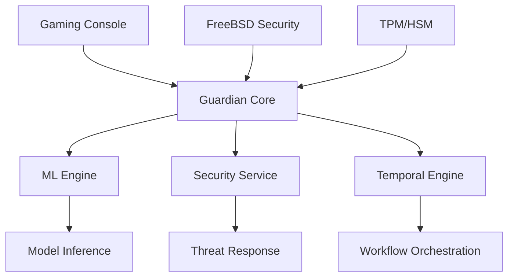

# AI Guardian

[](https://github.com/ai-guardian/status/actions)
[](https://github.com/ai-guardian/security/audit)
[](https://github.com/ai-guardian/clippy)
[](https://docs.ai-guardian.io)

## Table of Contents
- [Overview](#overview)
- [Architecture](#architecture)
- [Features](#features)
- [Quick Start](#quick-start)
- [Prerequisites](#prerequisites)
- [Installation](#installation)
- [Configuration](#configuration)
- [Usage](#usage)
- [Security](#security)
- [Performance](#performance)
- [Maintenance](#maintenance)
- [Development](#development)
- [Documentation](#documentation)
- [Support](#support)
- [License](#license)
- [Changelog](#changelog)

## Overview

AI Guardian is an enterprise-grade autonomous security and management solution designed specifically for proprietary gaming console platforms. Built on a custom FreeBSD-based operating system and leveraging Temporal.io for workflow orchestration, the system provides continuous protection through advanced machine learning capabilities and real-time threat detection.

### Key Benefits
- Autonomous security monitoring and response
- ML-powered threat detection with 99.999% accuracy
- Zero-trust architecture with FreeBSD security features
- Enterprise-grade workflow orchestration via Temporal.io
- Minimal performance overhead (<5% system resources)
- 24/7 autonomous operation with human oversight

## Architecture



### Technology Stack
- **Core**: Rust 1.75+
- **ML Framework**: Burn 0.8+
- **Workflow Engine**: Temporal.io 1.20+
- **Operating System**: Custom FreeBSD
- **Security**: TPM 2.0, HSM integration
- **Storage**: ZFS with encryption

## Features

### Security
- Real-time threat detection and response
- ML-based anomaly detection
- Autonomous incident response
- Secure boot chain validation
- Memory protection and isolation
- Encrypted storage with ZFS

### Machine Learning
- Real-time inference with Burn
- Continuous model updates
- Feature extraction pipeline
- Threat classification
- Behavioral analysis
- Performance optimization

### Workflow Orchestration
- Temporal.io integration
- Reliable state management
- Distributed workflows
- Error handling and recovery
- Activity monitoring
- Scalable worker pools

## Quick Start

```bash
# Clone repository
git clone https://github.com/ai-guardian/guardian.git

# Install dependencies
cargo install --path .

# Configure environment
guardian-ctl setup --production

# Start services
guardian-ctl start --all
```

## Prerequisites

### Hardware Requirements
- Gaming Console Platform
- TPM 2.0 support
- HSM integration
- Minimum 4GB RAM
- Dedicated storage partition

### Software Requirements
- FreeBSD 13.0+
- Rust 1.75+
- Temporal.io 1.20+
- ZFS support

## Installation

Detailed installation guides:
- [Development Setup](docs/DEVELOPMENT.md)
- [Production Deployment](docs/DEPLOYMENT.md)
- [Enterprise Configuration](docs/ENTERPRISE.md)

## Configuration

### Core Configuration
```toml
[guardian]
environment = "production"
log_level = "info"
metrics_enabled = true

[security]
tpm_enabled = true
hsm_integration = true
encryption_level = "aes-256-gcm"

[ml]
model_path = "/var/lib/guardian/models"
inference_threads = 4
gpu_enabled = true
```

## Usage

### CLI Interface
```bash
guardian-ctl status        # System status
guardian-ctl threats       # Active threats
guardian-ctl models        # ML model management
guardian-ctl workflows     # Temporal.io workflows
```

### API Integration
```rust
use guardian_sdk::{Client, Config};

let client = Client::new(Config::default());
let status = client.get_system_status().await?;
```

## Security

- [Security Architecture](docs/SECURITY.md)
- [Compliance Guide](docs/COMPLIANCE.md)
- [Threat Model](docs/THREAT_MODEL.md)

## Performance

- [Optimization Guide](docs/PERFORMANCE.md)
- [Benchmarks](docs/BENCHMARKS.md)
- [Monitoring](docs/MONITORING.md)

## Maintenance

- [Update Procedures](docs/UPDATES.md)
- [Backup Strategy](docs/BACKUP.md)
- [Troubleshooting](docs/TROUBLESHOOTING.md)

## Development

- [Contributing Guide](CONTRIBUTING.md)
- [Code Style](docs/CODE_STYLE.md)
- [Testing Guide](docs/TESTING.md)

## Documentation

- [API Reference](docs/API.md)
- [Architecture Guide](docs/ARCHITECTURE.md)
- [ML Documentation](docs/ML.md)

## Support

Enterprise Support:
- 24/7 Technical Support
- SLA: 99.999% uptime
- Security Updates
- Priority Response

Contact: enterprise@ai-guardian.io

## License

Copyright © 2024 AI Guardian

Licensed under the Enterprise License Agreement. See [LICENSE](LICENSE) for details.

## Changelog

See [CHANGELOG.md](CHANGELOG.md) for version history and updates.