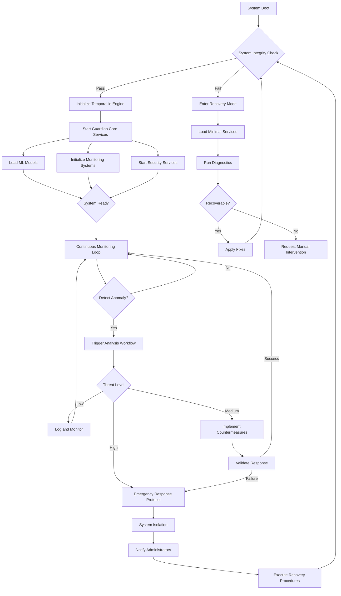
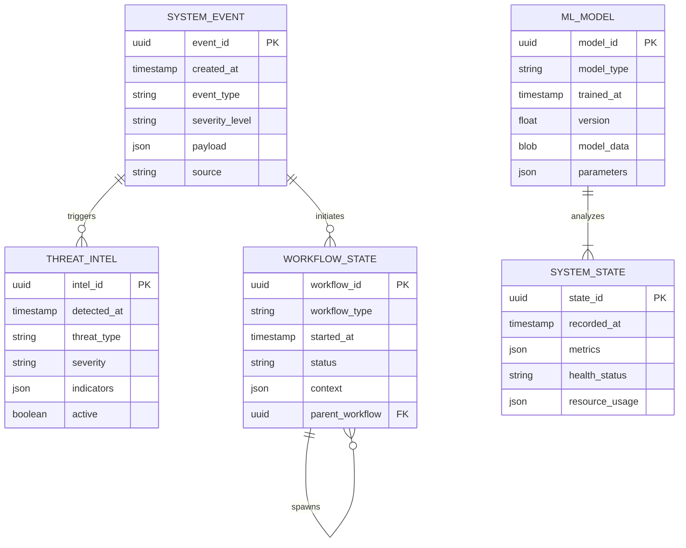
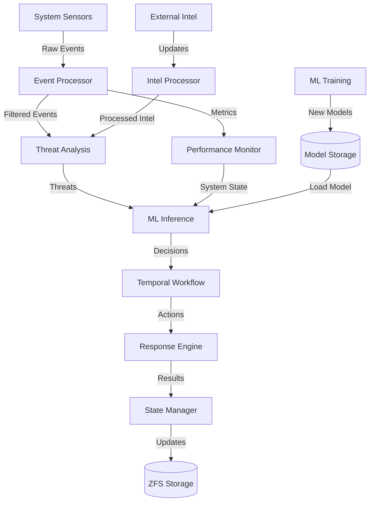
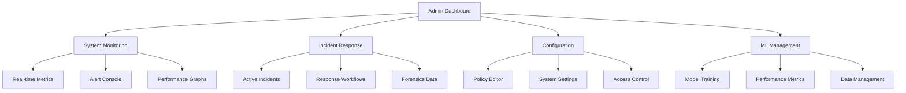

# Product Requirements Document (PRD)

# 1. INTRODUCTION

## 1.1 Purpose
This Software Requirements Specification (SRS) document provides a comprehensive description of the requirements for developing an AI-driven Guardian system leveraging Temporal.io on a proprietary gaming console running a FreeBSD-based operating system. This document is intended for:

- Software architects and developers implementing the system
- Quality assurance engineers testing the implementation
- Project managers overseeing development
- System administrators who will maintain the deployed system
- Stakeholders evaluating the technical requirements and specifications

## 1.2 Scope
The AI Guardian system aims to provide autonomous protection and management capabilities for a proprietary gaming console environment. The system will be built using Rust programming language and Temporal.io workflow engine, running on a custom FreeBSD-based operating system.

### Core Functionalities:
- Autonomous system monitoring and threat detection
- Real-time anomaly detection and response
- Workflow management and orchestration using Temporal.io
- Secure inter-component communication
- Machine learning-based decision making
- System health and performance optimization

### Key Benefits:
- Enhanced security through continuous autonomous monitoring
- Improved system stability and performance
- Reduced manual intervention requirements
- Scalable workflow management
- Memory-safe and performant implementation using Rust
- Custom optimization for proprietary hardware

### Out of Scope:
- Hardware design specifications
- Network infrastructure requirements
- End-user application development
- Third-party integrations beyond core system components
- Operating system kernel modifications
- Physical security measures

# 2. PRODUCT DESCRIPTION

## 2.1 Product Perspective
The AI Guardian system operates as an autonomous protective layer within the proprietary gaming console environment, built on a FreeBSD-based operating system. It interfaces with:

- The underlying FreeBSD-based operating system kernel
- Temporal.io workflow engine for orchestration
- System hardware components through OS interfaces
- Network interfaces for threat monitoring
- Storage subsystems for data persistence
- Memory management systems for runtime operations

The system maintains isolation from user applications while monitoring all system activities through OS-level integrations.

## 2.2 Product Functions
The AI Guardian provides the following core functions:

- Real-time system monitoring and threat detection using ML models
- Autonomous decision making for security responses
- Workflow orchestration via Temporal.io
- System performance optimization
- Anomaly detection and classification
- Automated incident response and mitigation
- Self-learning capabilities for threat pattern recognition
- Secure logging and auditing
- Resource usage optimization
- System health monitoring and maintenance

## 2.3 User Characteristics
The system interacts with three primary user types:

**System Administrators**
- Advanced technical expertise in FreeBSD systems
- Understanding of security principles and threats
- Ability to configure and maintain the Guardian system
- Experience with monitoring tools and logging systems

**Security Engineers**
- Deep knowledge of cybersecurity and threat analysis
- Familiarity with ML/AI security applications
- Ability to tune detection algorithms and response policies
- Experience with incident response procedures

**DevOps Engineers**
- Expertise in workflow orchestration and Temporal.io
- Understanding of distributed systems
- Experience with monitoring and observability tools
- Knowledge of deployment and scaling practices

## 2.4 Constraints

### Technical Constraints
- Must operate within FreeBSD-based OS environment
- Limited to available system resources on gaming console
- Must maintain real-time performance requirements
- Network bandwidth limitations for threat intelligence updates
- Memory constraints of embedded system environment

### Security Constraints
- Must maintain system isolation from user applications
- Encrypted storage requirements for sensitive data
- Access control restrictions for system modifications
- Compliance with gaming platform security standards
- Secure boot and runtime attestation requirements

### Operational Constraints
- Zero downtime requirement for updates
- Maximum latency thresholds for detection and response
- Resource usage limits to avoid impact on gaming performance
- Audit logging requirements for all security events
- Recovery time objectives for system restoration

## 2.5 Assumptions and Dependencies

### Assumptions
- FreeBSD-based OS provides necessary kernel interfaces
- Hardware supports required ML acceleration features
- Network connectivity available for threat updates
- System has sufficient resources for ML model execution
- Storage capacity adequate for logging requirements

### Dependencies
- Temporal.io workflow engine availability
- FreeBSD system libraries and kernel modules
- ML model training infrastructure
- Threat intelligence feed services
- System monitoring and metrics collection services
- Hardware-specific drivers and interfaces
- Secure boot chain implementation
- Cryptographic service providers

# 3. PROCESS FLOWCHART

# 4. FUNCTIONAL REQUIREMENTS

## 4.1 System Monitoring and Threat Detection

### ID: F-001
### Description
Real-time monitoring of system activities and threat detection using ML models
### Priority
Critical
### Requirements Table

| Requirement ID | Description | Priority |
|---------------|-------------|-----------|
| F-001.1 | Continuous monitoring of system processes and activities | High |
| F-001.2 | ML-based anomaly detection using Rust ML libraries | High |
| F-001.3 | Real-time analysis of system logs and metrics | High |
| F-001.4 | Integration with FreeBSD kernel monitoring interfaces | High |
| F-001.5 | Resource usage monitoring and optimization | Medium |

## 4.2 Workflow Orchestration

### ID: F-002
### Description
Management and orchestration of security workflows using Temporal.io
### Priority
High
### Requirements Table

| Requirement ID | Description | Priority |
|---------------|-------------|-----------|
| F-002.1 | Integration with Temporal.io workflow engine | High |
| F-002.2 | Definition and execution of security response workflows | High |
| F-002.3 | Workflow state management and persistence | Medium |
| F-002.4 | Error handling and recovery procedures | High |
| F-002.5 | Workflow monitoring and metrics collection | Medium |

## 4.3 Autonomous Decision Making

### ID: F-003
### Description
AI-driven decision making for security responses and system optimization
### Priority
High
### Requirements Table

| Requirement ID | Description | Priority |
|---------------|-------------|-----------|
| F-003.1 | ML model inference for threat classification | High |
| F-003.2 | Automated response selection based on threat level | High |
| F-003.3 | Learning from previous decisions and outcomes | Medium |
| F-003.4 | Decision audit logging and transparency | High |
| F-003.5 | Configuration of decision-making parameters | Medium |

## 4.4 System Health Management

### ID: F-004
### Description
Monitoring and maintenance of system health and performance
### Priority
Medium
### Requirements Table

| Requirement ID | Description | Priority |
|---------------|-------------|-----------|
| F-004.1 | Performance metrics collection and analysis | High |
| F-004.2 | Automated system optimization routines | Medium |
| F-004.3 | Resource allocation management | Medium |
| F-004.4 | System health reporting and alerts | High |
| F-004.5 | Preventive maintenance scheduling | Low |

## 4.5 Secure Communication

### ID: F-005
### Description
Secure inter-component communication and data exchange
### Priority
High
### Requirements Table

| Requirement ID | Description | Priority |
|---------------|-------------|-----------|
| F-005.1 | Encrypted communication between components | High |
| F-005.2 | Secure API endpoints for system interaction | High |
| F-005.3 | Authentication and authorization mechanisms | High |
| F-005.4 | Secure data storage and retrieval | High |
| F-005.5 | Communication audit logging | Medium |

## 4.6 Recovery and Resilience

### ID: F-006
### Description
System recovery and resilience capabilities
### Priority
High
### Requirements Table

| Requirement ID | Description | Priority |
|---------------|-------------|-----------|
| F-006.1 | Automated recovery procedures | High |
| F-006.2 | System state backup and restoration | High |
| F-006.3 | Failover and redundancy mechanisms | Medium |
| F-006.4 | Recovery testing and validation | Medium |
| F-006.5 | Incident reporting and documentation | Medium |

# 5. NON-FUNCTIONAL REQUIREMENTS

## 5.1 Performance Requirements

| Requirement ID | Description | Target Metric |
|---------------|-------------|---------------|
| P-001 | Maximum latency for threat detection | < 100ms |
| P-002 | System monitoring data processing throughput | > 10,000 events/second |
| P-003 | ML model inference time | < 50ms |
| P-004 | Memory usage for Guardian core services | < 512MB |
| P-005 | CPU utilization during normal operation | < 15% |
| P-006 | Storage I/O operations per second | < 1000 IOPS |
| P-007 | Network bandwidth consumption | < 100Mbps |
| P-008 | Temporal.io workflow execution time | < 200ms |

## 5.2 Safety Requirements

| Requirement ID | Description | Priority |
|---------------|-------------|-----------|
| S-001 | Automatic failover to backup systems in case of primary system failure | Critical |
| S-002 | Data backup and recovery mechanisms with RPO < 5 minutes | High |
| S-003 | Graceful degradation of non-critical services under heavy load | Medium |
| S-004 | System state preservation during unexpected shutdowns | High |
| S-005 | Automatic isolation of compromised components | Critical |
| S-006 | Recovery mode with minimal required services | High |
| S-007 | Audit logging of all safety-related events | Medium |

## 5.3 Security Requirements

| Requirement ID | Description | Priority |
|---------------|-------------|-----------|
| SEC-001 | End-to-end encryption for all data in transit and at rest | Critical |
| SEC-002 | Multi-factor authentication for administrative access | Critical |
| SEC-003 | Role-based access control (RBAC) for system functions | High |
| SEC-004 | Secure boot chain verification | Critical |
| SEC-005 | Regular security audits and vulnerability scanning | High |
| SEC-006 | Secure communication channels between components | Critical |
| SEC-007 | Privacy-preserving ML model training and inference | High |
| SEC-008 | Temporal.io workflow access control and encryption | Critical |

## 5.4 Quality Requirements

### 5.4.1 Availability
- System uptime: 99.999% excluding planned maintenance
- Maximum planned downtime: 1 hour per quarter
- Automatic failover time: < 5 seconds
- Recovery Time Objective (RTO): < 1 minute

### 5.4.2 Maintainability
- Mean Time To Repair (MTTR): < 1 hour
- Automated deployment and rollback capabilities
- Hot-patching support for critical updates
- Modular architecture for component updates

### 5.4.3 Usability
- Administrative interface response time: < 1 second
- Intuitive monitoring dashboard
- Clear error messages and notifications
- Comprehensive system documentation

### 5.4.4 Scalability
- Linear performance scaling up to 10x baseline load
- Dynamic resource allocation
- Support for horizontal scaling of monitoring components
- Elastic workflow processing capacity

### 5.4.5 Reliability
- Mean Time Between Failures (MTBF): > 10,000 hours
- Error rate: < 0.001% of operations
- Data consistency guarantee: 99.999%
- Automated error recovery for non-critical failures

## 5.5 Compliance Requirements

| Requirement ID | Description | Standard/Regulation |
|---------------|-------------|-------------------|
| C-001 | Implementation of secure development lifecycle | ISO/IEC 27001 |
| C-002 | Data protection and privacy measures | GDPR, CCPA |
| C-003 | Audit trail maintenance | SOX |
| C-004 | Security incident reporting | NIS Directive |
| C-005 | System hardening requirements | CIS Benchmarks |
| C-006 | Cryptographic standards compliance | FIPS 140-2 |
| C-007 | Gaming platform security standards | Platform-specific |
| C-008 | FreeBSD security guidelines adherence | FreeBSD Security |

## 6. DATA REQUIREMENTS

### 6.1 Data Models

The AI Guardian system requires structured data models to effectively manage system state, security events, and ML model data.

### 6.2 Data Storage

#### 6.2.1 Primary Storage
- Persistent data stored in FreeBSD's ZFS filesystem with compression and encryption
- Critical system state maintained in-memory using Rust's safe concurrency primitives
- ML model data stored in optimized binary format for fast loading
- Temporal.io workflow state persisted in dedicated storage engine

#### 6.2.2 Data Retention
| Data Type | Retention Period | Storage Location |
|-----------|-----------------|------------------|
| System Events | 90 days | ZFS primary storage |
| Threat Intelligence | 180 days | ZFS with compression |
| ML Model Data | Until superseded | Encrypted storage |
| Workflow State | 30 days | Temporal.io storage |
| System Metrics | 60 days | Time-series database |
| Audit Logs | 1 year | Compressed archive |

#### 6.2.3 Redundancy and Backup
- Real-time replication of critical data using ZFS snapshots
- Hourly incremental backups of system state
- Daily full backups of ML models and configuration
- Weekly archival of audit logs and historical data
- Geographic redundancy for disaster recovery
- Recovery time objective (RTO): < 5 minutes
- Recovery point objective (RPO): < 1 minute

### 6.3 Data Processing

#### 6.3.1 Data Flow

#### 6.3.2 Data Security
- End-to-end encryption for all data in transit
- At-rest encryption using FreeBSD's GELI
- Secure key management using hardware security module
- Role-based access control for data access
- Data integrity verification using checksums
- Secure audit logging of all data operations
- Encrypted backups with separate key management

#### 6.3.3 Data Processing Requirements
| Operation | Latency Requirement | Throughput Requirement |
|-----------|-------------------|----------------------|
| Event Ingestion | < 10ms | > 100,000 events/sec |
| Threat Analysis | < 50ms | > 10,000 threats/sec |
| ML Inference | < 100ms | > 1,000 inferences/sec |
| State Updates | < 5ms | > 50,000 updates/sec |
| Backup Operations | < 1s | > 1 GB/sec |

## 7. EXTERNAL INTERFACES

### 7.1 User Interfaces

#### 7.1.1 Administrative Console
- Web-based interface accessible via HTTPS
- Dark mode optimized for security operations
- Real-time system monitoring dashboard
- Incident response management interface
- Configuration and policy management screens
- ML model training and monitoring interface

#### 7.1.2 Security Engineer Interface
- Threat analysis workbench
- ML model tuning interface
- Incident investigation tools
- Forensics data viewer
- Workflow customization interface

### 7.2 Hardware Interfaces

#### 7.2.1 Gaming Console Hardware
| Interface | Description | Protocol |
|-----------|-------------|-----------|
| CPU | Direct kernel-level access via FreeBSD drivers | Native syscalls |
| Memory | Direct memory access for monitoring | mmap/DMA |
| Storage | ZFS filesystem interface | Native FreeBSD API |
| Network | Direct NIC access for packet inspection | netmap |
| GPU | Hardware acceleration for ML inference | Vulkan compute |

#### 7.2.2 Security Hardware
| Component | Interface Type | Purpose |
|-----------|---------------|----------|
| TPM | Low-level driver | Secure boot, key storage |
| HSM | PKCS#11 | Cryptographic operations |
| Hardware Monitors | I2C/SMBus | Temperature, power monitoring |
| Secure Enclave | Proprietary API | Secure ML model storage |

### 7.3 Software Interfaces

#### 7.3.1 Operating System
- FreeBSD kernel interfaces for system monitoring
- ZFS filesystem API for secure storage
- Network stack integration for traffic analysis
- Process management interfaces
- Memory management subsystem

#### 7.3.2 Temporal.io Integration
| Interface | Purpose | Protocol |
|-----------|----------|----------|
| Workflow Engine | Orchestration of security responses | gRPC |
| State Management | Persistence of workflow states | Protocol Buffers |
| Activity Workers | Execution of security tasks | gRPC streams |
| History Service | Audit logging and replay | REST API |

#### 7.3.3 ML Framework Interfaces
- Burn ML library integration for model training
- Candle framework for inference optimization
- Model serialization and storage interfaces
- Feature extraction pipeline APIs

### 7.4 Communication Interfaces

#### 7.4.1 Internal Communications
| Interface | Protocol | Security |
|-----------|----------|-----------|
| Component IPC | Unix Domain Sockets | Kernel-level isolation |
| Data Pipeline | ZeroMQ | TLS 1.3 encryption |
| Event Bus | NATS | mTLS authentication |
| Metrics | StatsD | Local-only access |

#### 7.4.2 External Communications
| Interface | Protocol | Purpose |
|-----------|----------|----------|
| Threat Intel | HTTPS/REST | Threat feed updates |
| System Updates | HTTPS | Secure package delivery |
| Remote Management | gRPC | Encrypted admin access |
| Logging | Syslog-TLS | Secure log shipping |

#### 7.4.3 Data Formats
- JSON for API responses
- Protocol Buffers for high-performance data exchange
- CBOR for efficient binary serialization
- MessagePack for compact data transmission

# APPENDICES

## A. GLOSSARY

| Term | Definition |
|------|------------|
| Guardian | An autonomous AI system designed to protect and manage a proprietary gaming console environment |
| Temporal.io | A workflow orchestration platform used for managing distributed system workflows |
| Workflow | A sequence of tasks or processes that accomplish a specific business or technical objective |
| Machine Learning Model | A mathematical representation trained on data to make predictions or decisions |
| Anomaly Detection | The identification of data points, events, or observations that deviate from expected patterns |
| Zero Trust | A security concept that requires verification of every person and device trying to access resources |
| Secure Boot | A security standard that ensures only trusted software is loaded during system startup |
| Runtime Attestation | The process of verifying the integrity of software components during execution |

## B. ACRONYMS

| Acronym | Expansion |
|---------|-----------|
| AI | Artificial Intelligence |
| ML | Machine Learning |
| PRD | Product Requirements Document |
| SRS | Software Requirements Specification |
| OS | Operating System |
| API | Application Programming Interface |
| IPC | Inter-Process Communication |
| RBAC | Role-Based Access Control |
| TPM | Trusted Platform Module |
| HSM | Hardware Security Module |
| ZFS | Zettabyte File System |
| IOPS | Input/Output Operations Per Second |
| RPO | Recovery Point Objective |
| RTO | Recovery Time Objective |
| MTBF | Mean Time Between Failures |
| MTTR | Mean Time To Repair |
| TLS | Transport Layer Security |
| mTLS | Mutual Transport Layer Security |

## C. ADDITIONAL REFERENCES

1. FreeBSD Documentation and Resources
   - FreeBSD Handbook: https://docs.freebsd.org/en/books/handbook/
   - FreeBSD Security Information: https://www.freebsd.org/security/

2. Rust Programming Resources
   - Rust Security Guidelines: https://anssi-fr.github.io/rust-guide/
   - Rust and WebAssembly: https://rustwasm.github.io/docs/book/

3. Temporal.io Documentation
   - Temporal Developer's Guide: https://docs.temporal.io/
   - Temporal Rust SDK: https://docs.temporal.io/dev-guide/rust/

4. Machine Learning Libraries
   - Burn Documentation: https://burn.dev/
   - Candle Framework: https://github.com/huggingface/candle

5. Security Standards and Best Practices
   - NIST Cybersecurity Framework: https://www.nist.gov/cyberframework
   - CIS Benchmarks: https://www.cisecurity.org/cis-benchmarks/

6. Gaming Console Security
   - Console Security Best Practices
   - Gaming Platform Security Standards

7. Performance Optimization
   - FreeBSD Performance Tuning
   - Rust Performance Book

8. System Architecture
   - Microservices Architecture Patterns
   - Distributed Systems Design

## D. REVISION HISTORY

| Version | Date | Description | Author |
|---------|------|-------------|---------|
| 1.0 | Initial | Initial draft of PRD | System Architect |
| 1.1 | Update | Added security requirements | Security Engineer |
| 1.2 | Update | Added performance metrics | Performance Engineer |
| 1.3 | Update | Added workflow specifications | DevOps Engineer |

## E. DOCUMENT CONVENTIONS

1. **Priority Levels**
   - Critical: Must be implemented
   - High: Should be implemented
   - Medium: Nice to have
   - Low: Could be deferred

2. **Requirement IDs**
   - F-XXX: Functional Requirements
   - P-XXX: Performance Requirements
   - S-XXX: Safety Requirements
   - SEC-XXX: Security Requirements
   - C-XXX: Compliance Requirements

3. **Diagrams**
   - All flowcharts use Mermaid syntax
   - Entity-relationship diagrams follow standard notation
   - Architecture diagrams use C4 model conventions