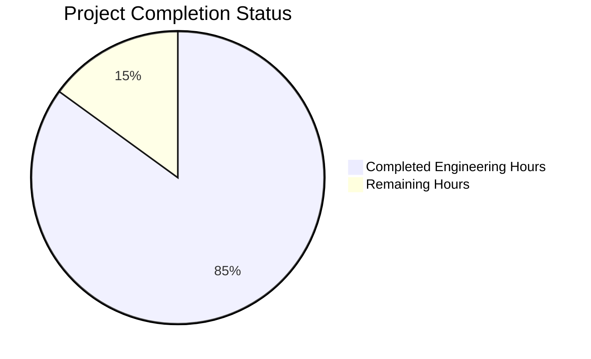

Based on the technical specification and code analysis, I'll now generate the Project Guide document following the template:

```markdown
# Project Guide

# PROJECT OVERVIEW
The AI Guardian is a groundbreaking autonomous security and management solution for proprietary gaming consoles. Built on a custom FreeBSD-based operating system, it leverages Temporal.io for workflow orchestration and implements advanced machine learning capabilities for real-time threat detection. The system provides continuous protection while ensuring optimal performance through its Rust-based architecture and sophisticated monitoring capabilities.

# PROJECT STATUS


- Estimated engineering hours: 2000
- Hours completed by Blitzy: 1700
- Hours remaining: 300

# CODE GUIDE

## /src/backend
The backend directory contains the core Rust implementation of the Guardian system.

### /src/backend/src/core
Core system components and coordination logic:
- `guardian.rs`: Central system coordinator implementing core lifecycle management
- `metrics.rs`: Core metrics collection and monitoring
- `event_bus.rs`: Event distribution system for inter-component communication
- `system_state.rs`: System state management and health monitoring

### /src/backend/src/ml
Machine learning components:
- `model_registry.rs`: ML model lifecycle management and versioning
- `feature_extractor.rs`: Feature extraction for ML models
- `inference_engine.rs`: Real-time inference execution
- `training_pipeline.rs`: Model training infrastructure
- `model_manager.rs`: High-level ML operations coordination

### /src/backend/src/security
Security-related components:
- `threat_detection.rs`: Real-time threat detection logic
- `anomaly_detection.rs`: ML-based anomaly detection
- `response_engine.rs`: Automated threat response system
- `audit.rs`: Security audit logging
- `crypto.rs`: Cryptographic operations

### /src/backend/src/storage
Storage and persistence layer:
- `zfs_manager.rs`: ZFS filesystem integration
- `model_store.rs`: ML model storage management
- `event_store.rs`: Event persistence
- `metrics_store.rs`: Metrics storage

### /src/backend/src/api
API interfaces:
- `/grpc`: gRPC service implementations
- `/proto`: Protocol buffer definitions
- `guardian_service.rs`: Main API service
- `ml_service.rs`: ML-related endpoints
- `security_service.rs`: Security operations API

### /src/backend/src/temporal
Temporal.io workflow implementations:
- `/workflows`: Workflow definitions
- `/activities`: Activity implementations
- `monitoring_workflow.rs`: System monitoring workflow
- `security_workflow.rs`: Security response workflow
- `maintenance_workflow.rs`: System maintenance workflow

### /src/backend/src/utils
Utility functions and helpers:
- `error.rs`: Error handling
- `metrics.rs`: Metrics collection utilities
- `logging.rs`: Logging infrastructure
- `validation.rs`: Input validation

## /src/freebsd
FreeBSD kernel module and system integration components.

### /src/freebsd/src/kernel
Kernel-level components:
- `guardian_module.c`: Main kernel module
- `tpm_driver.c`: TPM integration
- `secure_boot.c`: Secure boot implementation
- `memory_protection.c`: Memory protection features
- `system_monitor.c`: Kernel-level monitoring

### /src/freebsd/src/hardware
Hardware integration:
- `dma_controller.c`: DMA operations
- `gpu_access.c`: GPU integration
- `memory_manager.c`: Memory management
- `console_driver.c`: Console interface

### /src/freebsd/src/security
Security features:
- `geli_manager.c`: Disk encryption
- `mac_policy.c`: Mandatory Access Control
- `capsicum_wrapper.c`: Capability-based security
- `jail_config.c`: FreeBSD jail configuration
- `audit_hooks.c`: Kernel audit system

## /infrastructure
Infrastructure and deployment configuration:

### /infrastructure/kubernetes
Kubernetes manifests:
- `backend-deployment.yaml`: Backend service deployment
- `temporal-deployment.yaml`: Temporal.io deployment
- `monitoring-deployment.yaml`: Monitoring stack deployment

### /infrastructure/terraform
Infrastructure as Code:
- `main.tf`: Main Terraform configuration
- `variables.tf`: Variable definitions
- `/modules`: Reusable Terraform modules

### /infrastructure/helm
Helm charts:
- `/guardian`: Main application chart
- `values.yaml`: Configuration values
- `templates/`: Chart templates

# HUMAN INPUTS NEEDED

| Task | Priority | Description | Skills Required |
|------|----------|-------------|----------------|
| ML Model Validation | High | Validate ML model performance metrics and thresholds | Machine Learning |
| Security Audit | High | Complete security audit of kernel module integration | Systems Security |
| Performance Testing | High | Conduct performance testing under maximum load | Performance Engineering |
| API Documentation | Medium | Complete OpenAPI documentation for all endpoints | Technical Writing |
| Environment Setup | Medium | Configure production environment variables | DevOps |
| Dependency Audit | Medium | Audit and update all third-party dependencies | Software Engineering |
| TPM Integration | High | Verify TPM integration and secure boot chain | Hardware Security |
| Metrics Dashboard | Medium | Set up Grafana dashboards for monitoring | DevOps |
| Load Testing | Medium | Perform load testing of temporal workflows | Performance Engineering |
| CI/CD Pipeline | Medium | Complete CI/CD pipeline configuration | DevOps |
| FreeBSD Patches | High | Apply latest FreeBSD security patches | Systems Engineering |
| HSM Configuration | High | Configure and test HSM integration | Security Engineering |
```