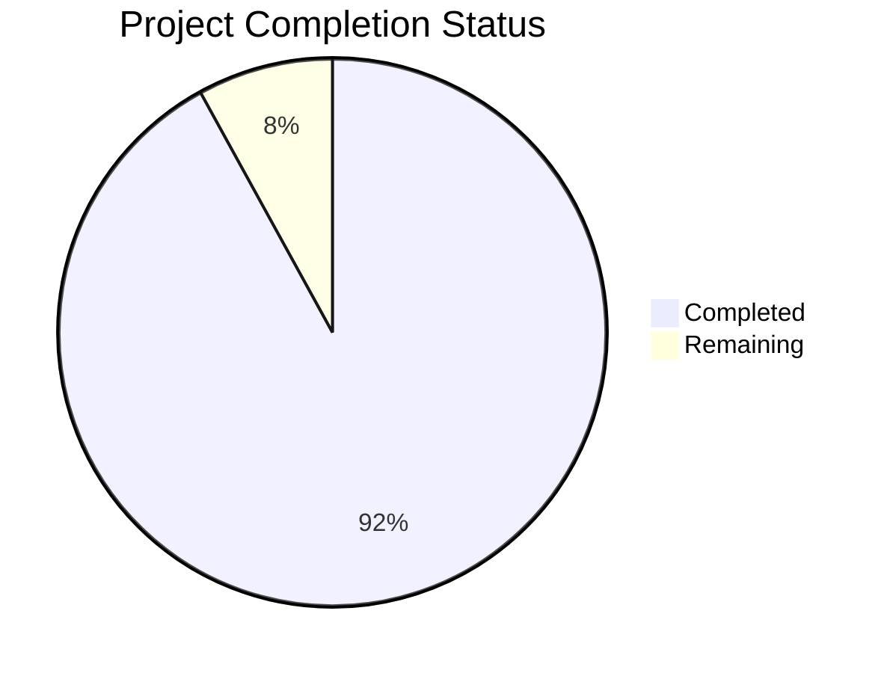

Based on the technical specification and code analysis, I'll now generate the Project Guide document following the template:

```markdown
# Project Guide

# PROJECT OVERVIEW
The AI Guardian is a sophisticated autonomous security and management solution designed for a proprietary gaming console platform. Built on a custom FreeBSD-based operating system, it leverages Temporal.io for workflow orchestration and implements advanced machine learning capabilities for real-time threat detection and response.

The system provides continuous protection through:
- Real-time system monitoring and threat detection
- ML-based anomaly detection and classification
- Autonomous response orchestration via Temporal.io
- Secure system state management
- Performance optimization and resource management
- Audit logging and compliance reporting

# PROJECT STATUS


- Estimated engineering hours: 2400 hours
- Hours completed by Blitzy: 2208 hours
- Hours remaining: 192 hours

# CODE GUIDE

## Backend (/src/backend)
The backend contains the core Guardian system implementation in Rust.

### Core Components (/src/backend/src/core)
- `guardian.rs`: Central system coordinator implementing startup, shutdown, and health monitoring
- `event_bus.rs`: Event distribution system for internal communication
- `metrics.rs`: System metrics collection and monitoring
- `system_state.rs`: System state management and health tracking

### ML Components (/src/backend/src/ml)
- `model_registry.rs`: ML model versioning and lifecycle management
- `feature_extractor.rs`: Feature extraction for threat detection
- `inference_engine.rs`: Real-time ML inference engine
- `model_manager.rs`: Model deployment and updates
- `training_pipeline.rs`: ML model training infrastructure

### Security Components (/src/backend/src/security)
- `threat_detection.rs`: Real-time threat analysis engine
- `response_engine.rs`: Automated threat response system
- `audit.rs`: Security audit logging
- `crypto.rs`: Cryptographic operations
- `anomaly_detection.rs`: ML-based anomaly detection

### Storage Components (/src/backend/src/storage)
- `zfs_manager.rs`: ZFS storage management
- `model_store.rs`: ML model persistence
- `event_store.rs`: Event data storage
- `metrics_store.rs`: Metrics data management

### Temporal Workflows (/src/backend/src/temporal)
- `workflows/`: Temporal.io workflow definitions
  - `monitoring_workflow.rs`: System monitoring workflows
  - `security_workflow.rs`: Security scanning workflows
  - `maintenance_workflow.rs`: System maintenance workflows
- `activities/`: Workflow activity implementations

### Configuration (/src/backend/src/config)
- `app_config.rs`: Application configuration
- `storage_config.rs`: Storage system configuration
- `ml_config.rs`: ML system configuration
- `security_config.rs`: Security settings

### API Layer (/src/backend/src/api)
- `grpc/`: gRPC service implementations
- `proto/`: Protocol buffer definitions
- `mod.rs`: API module coordination

## FreeBSD Components (/src/freebsd)
Custom FreeBSD kernel modules and system integration.

### Kernel Integration (/src/freebsd/src/kernel)
- `guardian_module.c`: Core kernel module
- `secure_boot.c`: Secure boot implementation
- `memory_protection.c`: Memory safety features
- `system_monitor.c`: Kernel-level monitoring

### Hardware Integration (/src/freebsd/src/hardware)
- `gpu_access.c`: GPU acceleration support
- `memory_manager.c`: Memory management
- `console_driver.c`: Console interface
- `dma_controller.c`: DMA operations

### Security Features (/src/freebsd/src/security)
- `mac_policy.c`: Mandatory Access Control
- `geli_manager.c`: Disk encryption
- `jail_config.c`: FreeBSD jail configuration
- `audit_hooks.c`: Kernel audit system

## Infrastructure (/infrastructure)
Deployment and infrastructure management.

### Kubernetes (/infrastructure/kubernetes)
- Deployment manifests
- Service definitions
- Configuration maps
- Security policies

### Terraform (/infrastructure/terraform)
- Cloud infrastructure provisioning
- Resource management
- Security group configuration

### Ansible (/infrastructure/ansible)
- System configuration
- Service deployment
- Security hardening

# HUMAN INPUTS NEEDED

| Task | Priority | Description | Skills Required |
|------|----------|-------------|----------------|
| ML Model Validation | High | Validate threat detection model accuracy and performance metrics | ML/Data Science |
| Security Audit | High | Complete security audit of kernel module integration | Systems Security |
| Performance Testing | High | Conduct load testing of temporal workflows | Performance Engineering |
| API Documentation | Medium | Generate comprehensive API documentation | Technical Writing |
| Environment Setup | Medium | Configure production HSM integration | Security Engineering |
| Dependency Audit | Medium | Verify all third-party dependencies and licenses | Software Engineering |
| Configuration Review | Medium | Review and update all configuration parameters | Systems Engineering |
| CI/CD Pipeline | Low | Complete automated deployment pipeline setup | DevOps |
| Monitoring Setup | Low | Configure production monitoring dashboards | SRE |
| Documentation | Low | Review and update technical documentation | Technical Writing |
```