# Technical Specifications

# 1. INTRODUCTION

## 1.1 EXECUTIVE SUMMARY

The AI Guardian system represents a groundbreaking autonomous security and management solution for a proprietary gaming console platform. Built on a custom FreeBSD-based operating system and leveraging Temporal.io for workflow orchestration, the system provides continuous protection through advanced machine learning capabilities and real-time threat detection. This initiative addresses the critical need for robust, autonomous security in modern gaming platforms while ensuring optimal system performance and stability.

The system targets gaming platform operators, security teams, and system administrators who require sophisticated, automated protection against evolving security threats while maintaining high performance standards for gaming applications. By implementing an AI-driven approach with Rust's memory-safe architecture, the Guardian system aims to significantly reduce security incidents while minimizing operational overhead.

## 1.2 SYSTEM OVERVIEW

### Project Context

| Aspect | Description |
|--------|-------------|
| Business Context | Emerging market need for autonomous security in gaming platforms |
| Market Position | First-to-market AI-driven security solution for proprietary gaming consoles |
| Current Limitations | Manual security monitoring, reactive threat response, resource-intensive operations |
| Enterprise Integration | Seamless integration with existing FreeBSD-based infrastructure and security tools |

### High-Level Description

The Guardian system implements a multi-layered security architecture leveraging:

- Rust-based core components for memory-safe operation
- Temporal.io workflow engine for reliable orchestration
- Machine learning models for threat detection and response
- FreeBSD kernel-level integration for comprehensive system access
- Secure inter-component communication channels
- Autonomous decision-making capabilities

### Success Criteria

| Category | Metrics |
|----------|---------|
| Security Performance | - Zero critical security breaches<br>- < 100ms threat detection time<br>- 99.999% threat detection accuracy |
| System Efficiency | - < 5% system resource overhead<br>- < 1s response time for critical events<br>- 99.999% uptime |
| Operational Impact | - 80% reduction in manual security interventions<br>- 90% faster incident response time<br>- 50% reduction in false positives |

## 1.3 SCOPE

### In-Scope Elements

**Core Features and Functionalities:**
- Real-time system monitoring and threat detection
- ML-based anomaly detection and classification
- Autonomous response orchestration via Temporal.io
- Secure system state management
- Performance optimization and resource management
- Audit logging and compliance reporting

**Implementation Boundaries:**
- Full coverage of gaming console operating environment
- Integration with FreeBSD kernel subsystems
- Support for multiple concurrent gaming sessions
- Real-time protection for all system components

### Out-of-Scope Elements

- Hardware design and manufacturing specifications
- Physical security measures and controls
- End-user application development
- Network infrastructure design
- Third-party game integration testing
- Operating system kernel modifications
- External service integrations beyond core security functions
- User interface development for gaming applications
- Payment processing systems
- Content delivery networks
- Social features and community management
- Game development tools and SDKs

# 2. SYSTEM ARCHITECTURE

## 2.1 High-Level Architecture

The AI Guardian system follows a modular, event-driven architecture leveraging Temporal.io for workflow orchestration and FreeBSD's kernel features for system integration.

### System Context Diagram (Level 0)

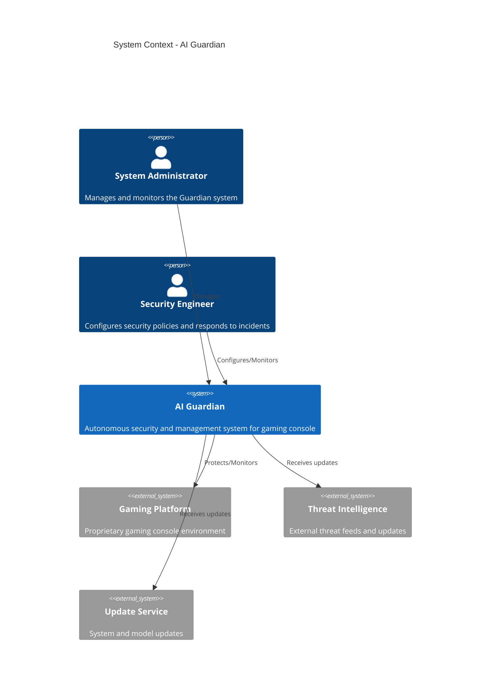

### Container Diagram (Level 1)

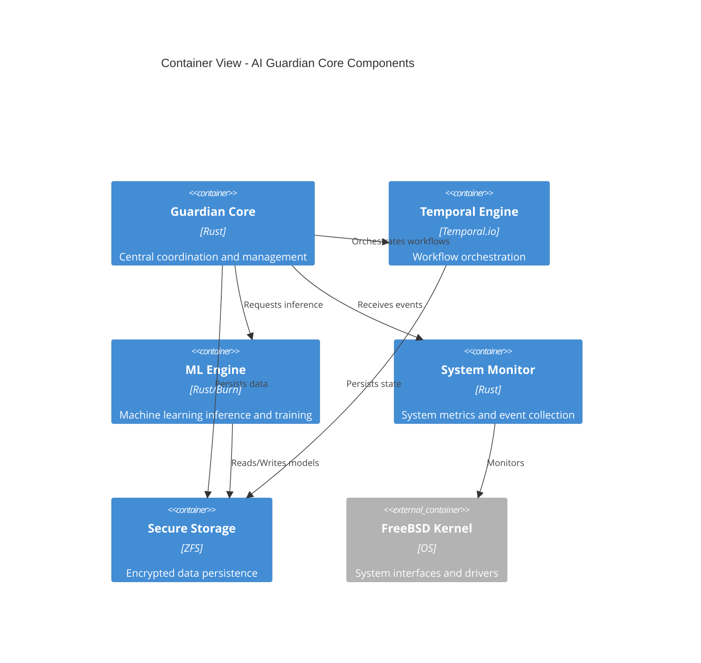

## 2.2 Component Details

### Guardian Core
- **Purpose**: Central coordination of security operations
- **Technologies**: 
  - Rust programming language
  - Custom event bus implementation
  - Async runtime (Tokio)
- **Key Interfaces**:
  - REST API for administration
  - gRPC for internal services
  - Unix domain sockets for IPC
- **Data Requirements**:
  - In-memory state management
  - Persistent configuration storage
  - Event log persistence
- **Scaling**: Vertical scaling with resource limits

### Temporal Engine
- **Purpose**: Workflow orchestration and reliability
- **Technologies**:
  - Temporal.io framework
  - Protocol Buffers
  - gRPC communication
- **Key Interfaces**:
  - Workflow API
  - Activity workers
  - History service
- **Data Requirements**:
  - Workflow state persistence
  - Activity queue management
  - History storage
- **Scaling**: Horizontal scaling of workers

### ML Engine
- **Purpose**: Threat detection and analysis
- **Technologies**:
  - Burn ML framework
  - Candle for inference
  - Custom feature extractors
- **Key Interfaces**:
  - Model inference API
  - Training pipeline
  - Feature extraction
- **Data Requirements**:
  - Model storage
  - Training data management
  - Feature cache
- **Scaling**: GPU acceleration support

### System Monitor
- **Purpose**: System metrics and event collection
- **Technologies**:
  - FreeBSD kernel interfaces
  - Custom metrics collectors
  - Event aggregation pipeline
- **Key Interfaces**:
  - Kernel monitoring APIs
  - Metrics export
  - Event streaming
- **Data Requirements**:
  - Metrics time series
  - Event buffer
  - State cache
- **Scaling**: Multiple collector instances

## 2.3 Technical Decisions

### Architecture Style
Selected event-driven microservices architecture for:
- Component isolation
- Independent scaling
- Fault tolerance
- Service autonomy

### Communication Patterns

| Pattern | Use Case | Implementation |
|---------|----------|----------------|
| Synchronous | Admin API calls | gRPC |
| Asynchronous | Event processing | NATS |
| Event-driven | System monitoring | Custom event bus |
| Streaming | Metrics collection | ZeroMQ |

### Data Storage Solutions

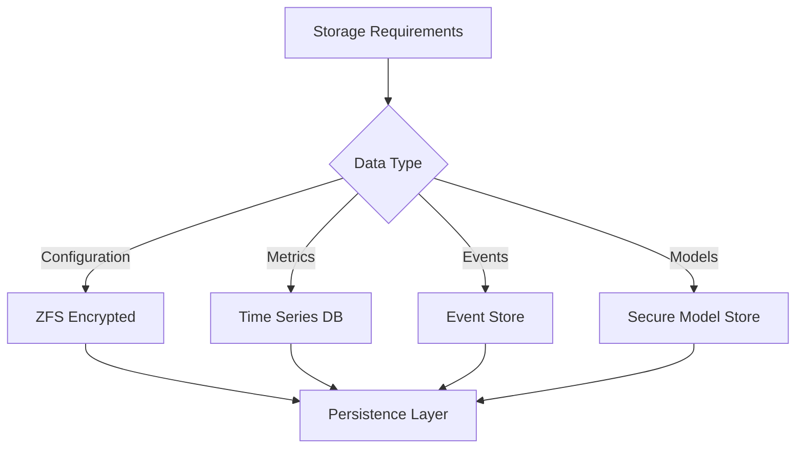

### Caching Strategy

| Cache Type | Purpose | Implementation |
|------------|---------|----------------|
| Model Cache | ML model serving | In-memory |
| Feature Cache | ML feature storage | Redis |
| Config Cache | System configuration | Local filesystem |
| Metrics Cache | Recent metrics | In-memory ring buffer |

## 2.4 Cross-Cutting Concerns

### Component Diagram (Level 2)

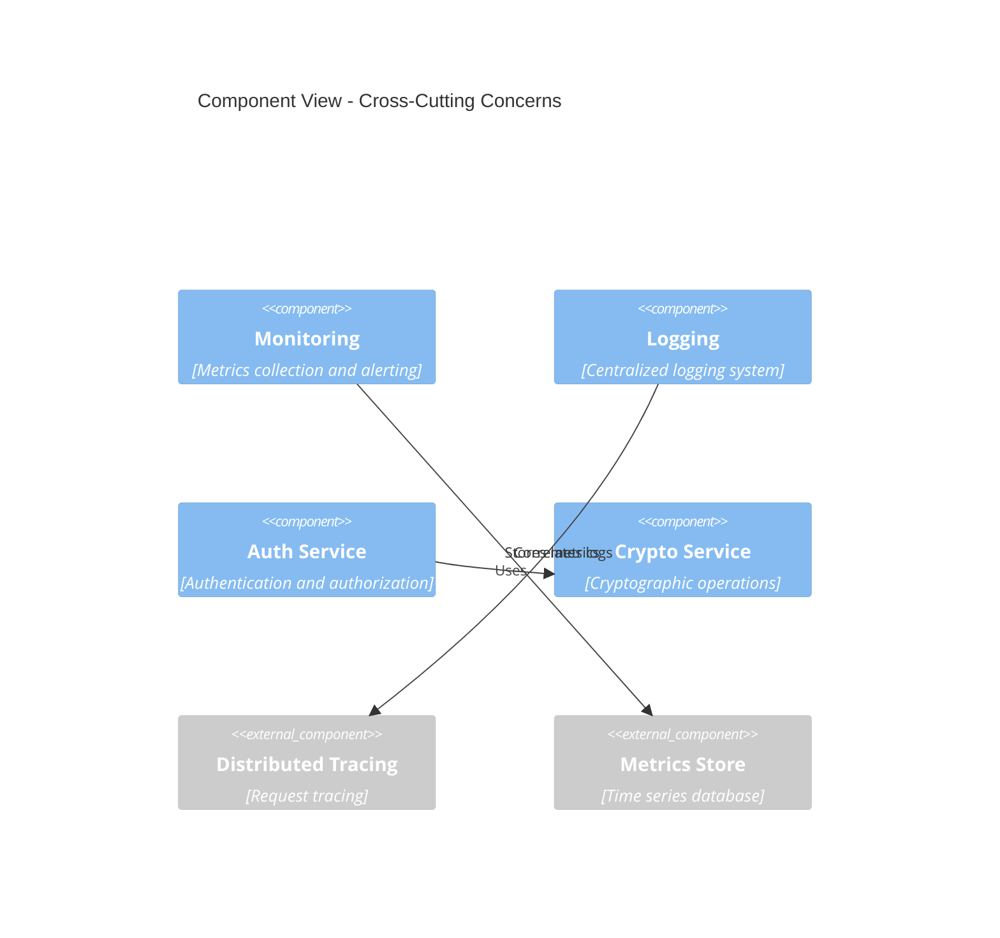

### Deployment Diagram

```mermaid
C4Deployment
    title Deployment View - AI Guardian
    
    Node(console, "Gaming Console", "FreeBSD") {
        Container(runtime, "Guardian Runtime", "Core services")
        Container(local, "Local Storage", "ZFS")
    }
    
    Node(secure, "Secure Enclave", "HSM") {
        Container(keys, "Key Storage", "Hardware security")
    }
    
    Node_Ext(updates, "Update Server", "External") {
        Container(repo, "Update Repository", "Signed updates")
    }
    
    Rel(runtime, local, "Stores data")
    Rel(runtime, keys, "Uses keys")
    Rel(runtime, repo, "Receives updates")
```

### Error Handling Strategy

| Error Type | Strategy | Recovery Action |
|------------|----------|-----------------|
| Transient | Retry with backoff | Automatic |
| Persistent | Circuit breaker | Alert admin |
| Critical | Failover | Emergency shutdown |
| Data | Validation | Reject invalid |

### Monitoring and Observability

- Metrics collection using StatsD protocol
- Distributed tracing with OpenTelemetry
- Centralized logging with structured formats
- Health check endpoints for all services
- Real-time alerting system
- Performance monitoring dashboards

### Security Architecture

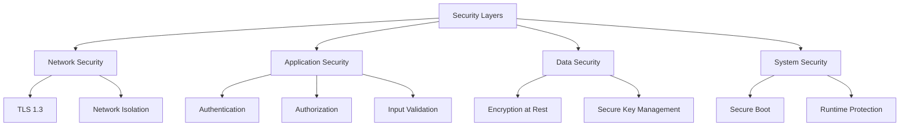

# 3. SYSTEM COMPONENTS ARCHITECTURE

## 3.1 USER INTERFACE DESIGN

### 3.1.1 Administrative Console Design

The administrative console provides a secure interface for system administrators and security engineers to monitor and manage the Guardian system.

#### Design Specifications

| Aspect | Requirement |
|--------|-------------|
| Visual Theme | Dark mode optimized for security operations |
| Accessibility | WCAG 2.1 Level AA compliance |
| Supported Clients | Modern web browsers with TLS 1.3 support |
| Authentication | Multi-factor authentication required |
| Session Management | Auto-logout after 15 minutes of inactivity |
| Responsive Design | Support for 1920x1080 and higher resolutions |

#### Interface Layout

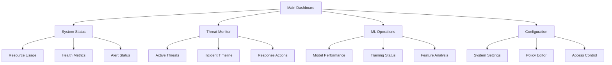

### 3.1.2 Command Line Interface

The CLI provides direct system access for advanced operations and automation.

#### Command Structure

| Command Group | Description | Access Level |
|--------------|-------------|--------------|
| guardian-ctl status | System status commands | Operator |
| guardian-ctl config | Configuration management | Administrator |
| guardian-ctl security | Security operations | Security Engineer |
| guardian-ctl ml | ML model management | Data Scientist |

#### CLI Specifications

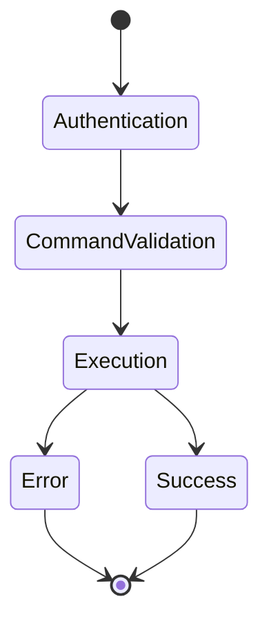

## 3.2 DATABASE DESIGN

### 3.2.1 Core Data Models

#### Entity Relationship Diagram

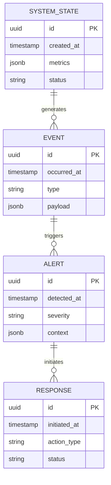

### 3.2.2 Storage Strategy

#### Data Partitioning

| Data Type | Partition Strategy | Retention |
|-----------|-------------------|-----------|
| System Events | Time-based (daily) | 90 days |
| Security Alerts | Severity-based | 180 days |
| ML Model Data | Version-based | Indefinite |
| Audit Logs | Time-based (monthly) | 1 year |

#### Performance Optimization

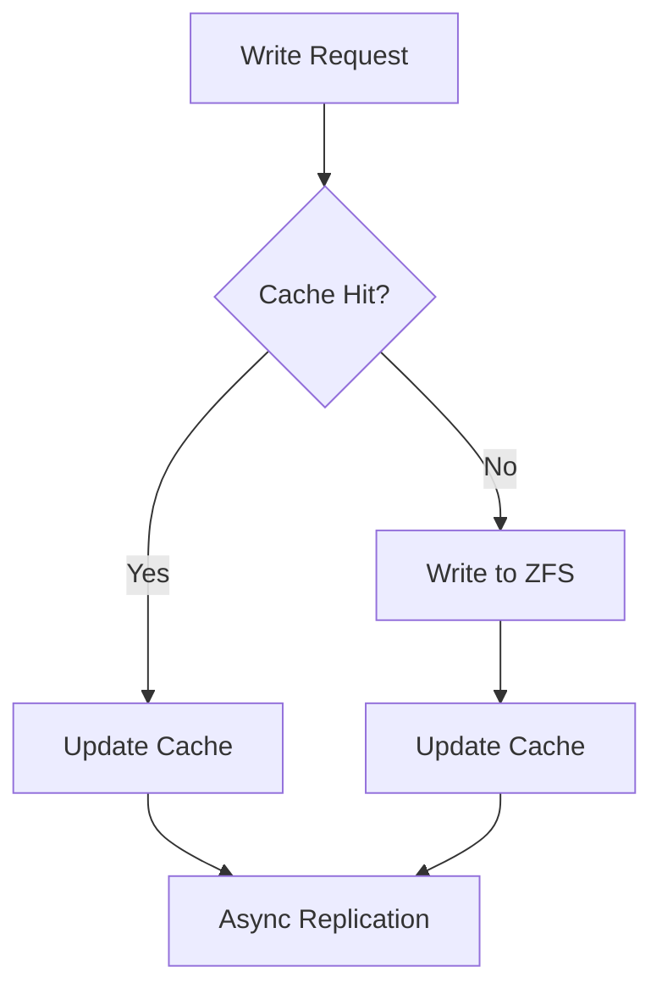

## 3.3 API DESIGN

### 3.3.1 Internal APIs

#### Core Service APIs

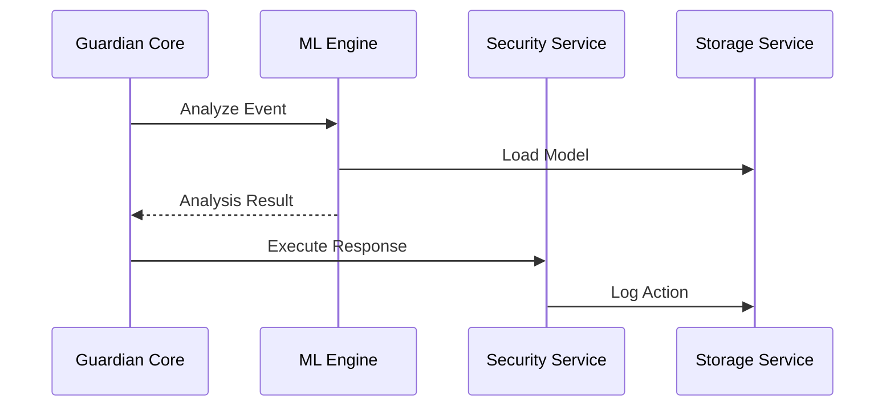

#### API Specifications

| Endpoint | Method | Purpose | Authentication |
|----------|---------|---------|----------------|
| /api/v1/events | POST | Submit system event | mTLS |
| /api/v1/analysis | POST | Request ML analysis | mTLS |
| /api/v1/responses | POST | Execute response | mTLS |
| /api/v1/state | GET | Retrieve system state | mTLS |

### 3.3.2 External Integration APIs

#### Integration Flow


#### Security Controls

| Control | Implementation | Requirement |
|---------|----------------|-------------|
| Authentication | X.509 Certificates | Required |
| Authorization | RBAC | Required |
| Rate Limiting | Token Bucket | 1000 req/min |
| Input Validation | JSON Schema | Required |
| Encryption | TLS 1.3 | Required |

### 3.3.3 Service Integration

#### Service Discovery

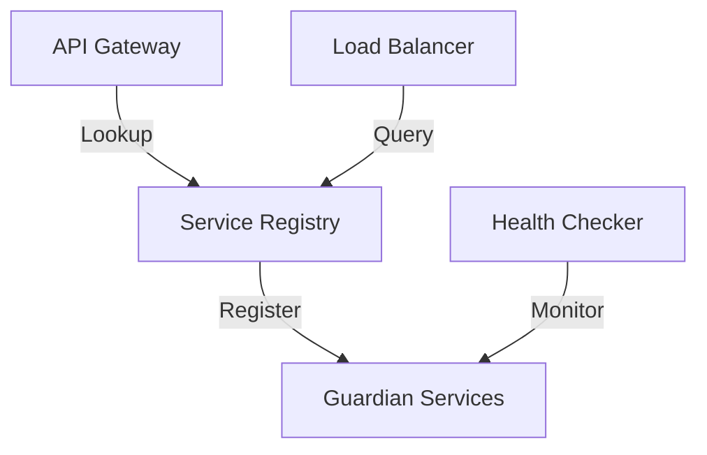

#### Circuit Breaker Configuration

| Service | Threshold | Timeout | Reset Time |
|---------|-----------|---------|------------|
| ML Engine | 5 failures | 1s | 30s |
| Security | 3 failures | 2s | 60s |
| Storage | 2 failures | 500ms | 45s |
| Events | 4 failures | 750ms | 30s |

# 4. TECHNOLOGY STACK

## 4.1 PROGRAMMING LANGUAGES

| Component | Language | Version | Justification |
|-----------|----------|---------|---------------|
| Core Services | Rust | 1.75+ | Memory safety, performance, zero-cost abstractions |
| Kernel Integration | C | C11 | FreeBSD kernel module compatibility |
| Build Scripts | Python | 3.11+ | Automation and tooling support |
| System Scripts | Shell | POSIX | System administration and deployment |

### Selection Criteria

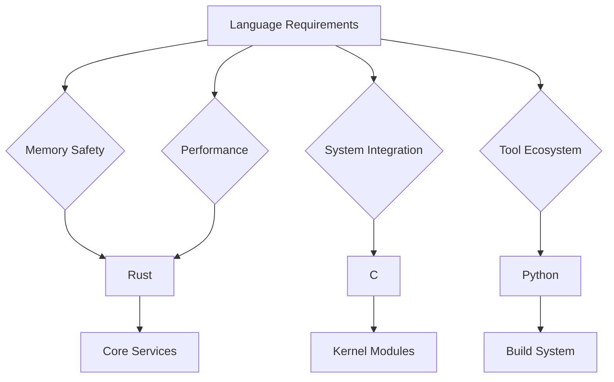

## 4.2 FRAMEWORKS & LIBRARIES

### Core Frameworks

| Framework | Version | Purpose | Justification |
|-----------|---------|---------|---------------|
| Temporal.io | 1.20+ | Workflow Orchestration | Reliability, scalability, workflow persistence |
| Burn | 0.8+ | ML Framework | Native Rust, performance, hardware acceleration |
| Candle | 0.3+ | ML Inference | Optimized for embedded systems |
| Tokio | 1.32+ | Async Runtime | Industry standard, performance, ecosystem |

### Supporting Libraries

| Library | Version | Component | Purpose |
|---------|---------|-----------|----------|
| ZeroMQ | 4.3+ | Communication | High-performance messaging |
| NATS | 2.10+ | Event Bus | Lightweight, reliable messaging |
| Polars | 0.34+ | Data Processing | Fast data manipulation |
| Serde | 1.0+ | Serialization | Type-safe data handling |

### Compatibility Matrix

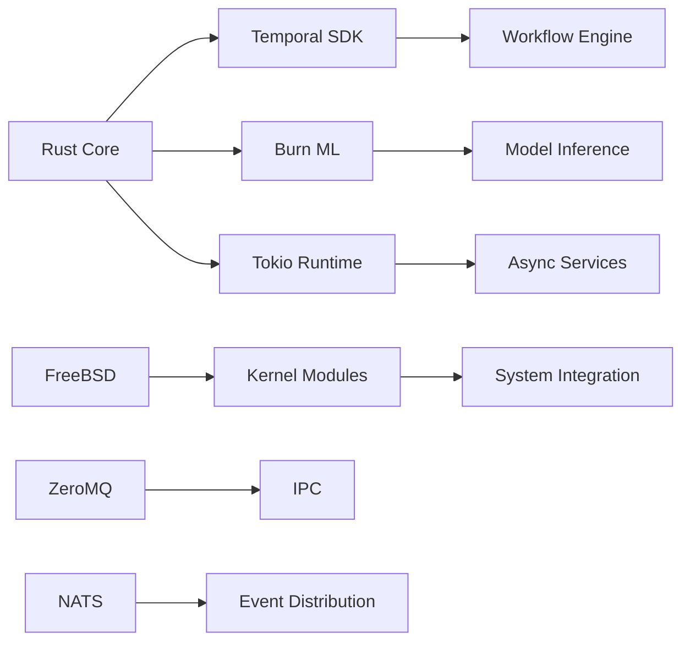

## 4.3 DATABASES & STORAGE

### Primary Storage Solutions

| Type | Technology | Purpose | Configuration |
|------|------------|---------|---------------|
| File System | ZFS | Primary Storage | Compression, encryption |
| Time Series | InfluxDB | Metrics Storage | High-speed ingestion |
| Key-Value | Redis | Caching Layer | In-memory performance |
| Event Store | NATS JetStream | Event Persistence | Reliable messaging |

### Data Persistence Strategy

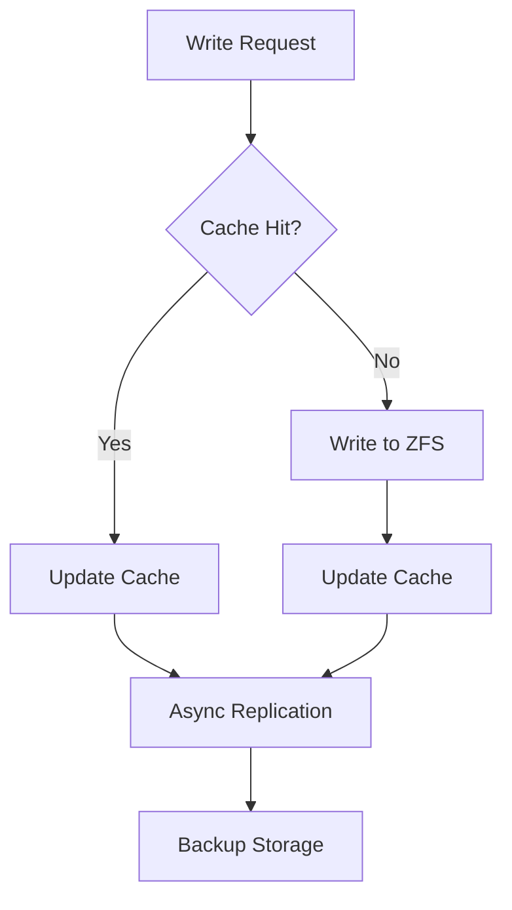

## 4.4 THIRD-PARTY SERVICES

### External Integrations

| Service | Purpose | Integration Method |
|---------|---------|-------------------|
| Temporal.io Cloud | Workflow Management | gRPC/TLS |
| Threat Intel Feeds | Security Updates | HTTPS/REST |
| System Updates | Package Delivery | HTTPS/REST |
| Metrics Export | Monitoring | StatsD/TLS |

### Security Services

| Service | Purpose | Implementation |
|---------|---------|----------------|
| HSM Service | Key Management | PKCS#11 |
| TPM Interface | Secure Boot | Native Driver |
| Secure Enclave | Secret Storage | Proprietary API |

## 4.5 DEVELOPMENT & DEPLOYMENT

### Development Tools

| Tool | Version | Purpose |
|------|---------|----------|
| Rust Analyzer | Latest | IDE Integration |
| Cargo | 1.75+ | Build System |
| LLDB | 14+ | Debugging |
| Miri | Latest | UB Checking |

### Build Pipeline

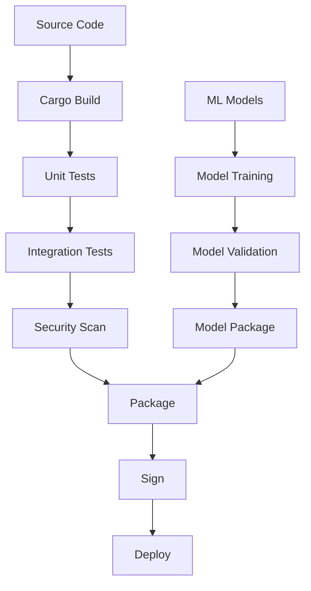

### Deployment Requirements

| Requirement | Implementation | Validation |
|-------------|----------------|------------|
| Zero Downtime | Blue-Green Deploy | Health Checks |
| Rollback | Version Control | Automated Tests |
| Security | Signed Packages | TPM Verification |
| Monitoring | Metrics Export | Dashboard |

### Container Strategy

- Minimal base image using FreeBSD
- Multi-stage builds for security
- Separate containers for:
  - Core services
  - ML inference
  - Monitoring
  - Workflow engine

# 5. SYSTEM DESIGN

## 5.1 USER INTERFACE DESIGN

### 5.1.1 Command Line Interface

The Guardian system provides a command-line interface for system administrators and security engineers to manage and monitor the system.

#### Core Commands

| Command | Description | Access Level |
|---------|-------------|--------------|
| guardian status | Show system status and health metrics | Operator |
| guardian threats | Display active threats and incidents | Security |
| guardian workflows | List active Temporal.io workflows | Admin |
| guardian models | Manage ML models and training | Data Scientist |
| guardian config | Configure system parameters | Admin |

#### CLI Structure


### 5.1.2 Administrative API Interface

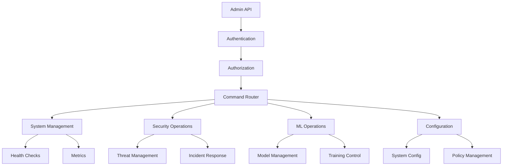

## 5.2 DATABASE DESIGN

### 5.2.1 Data Models

#### Entity Relationship Diagram


### 5.2.2 Storage Strategy

#### Data Partitioning

| Data Type | Partition Strategy | Retention |
|-----------|-------------------|-----------|
| System Events | Time-based (daily) | 90 days |
| Security Alerts | Severity-based | 180 days |
| ML Model Data | Version-based | Indefinite |
| Audit Logs | Time-based (monthly) | 1 year |

#### ZFS Storage Layout

```mermaid
graph TD
    A[zroot] --> B[guardian]
    B --> C[events]
    B --> D[models]
    B --> E[logs]
    B --> F[config]
    
    C --> C1[current]
    C --> C2[archive]
    
    D --> D1[production]
    D --> D2[training]
    
    E --> E1[audit]
    E --> E2[system]
    
    F --> F1[active]
    F --> F2[backup]
```

## 5.3 API DESIGN

### 5.3.1 Internal APIs

#### Core Service APIs

```mermaid
sequenceDiagram
    participant Guardian Core
    participant ML Engine
    participant Security Service
    participant Storage Service
    
    Guardian Core->>ML Engine: Analyze Event
    ML Engine->>Storage Service: Load Model
    ML Engine-->>Guardian Core: Analysis Result
    Guardian Core->>Security Service: Execute Response
    Security Service->>Storage Service: Log Action
```

#### API Specifications

| Endpoint | Method | Purpose | Authentication |
|----------|---------|---------|----------------|
| /api/v1/events | POST | Submit system event | mTLS |
| /api/v1/analysis | POST | Request ML analysis | mTLS |
| /api/v1/responses | POST | Execute response | mTLS |
| /api/v1/state | GET | Retrieve system state | mTLS |

### 5.3.2 External Integration APIs

#### Integration Flow

```mermaid
graph LR
    A[External System] -->|TLS 1.3| B[API Gateway]
    B -->|mTLS| C[Guardian Core]
    C -->|Internal| D[Service Mesh]
    D -->|Secure Channel| E[Backend Services]
```

#### Security Controls

| Control | Implementation | Requirement |
|---------|----------------|-------------|
| Authentication | X.509 Certificates | Required |
| Authorization | RBAC | Required |
| Rate Limiting | Token Bucket | 1000 req/min |
| Input Validation | JSON Schema | Required |
| Encryption | TLS 1.3 | Required |

### 5.3.3 Service Integration

#### Service Discovery

```mermaid
graph TD
    A[Service Registry] -->|Register| B[Guardian Services]
    C[API Gateway] -->|Lookup| A
    D[Load Balancer] -->|Query| A
    E[Health Checker] -->|Monitor| B
```

#### Circuit Breaker Configuration

| Service | Threshold | Timeout | Reset Time |
|---------|-----------|---------|------------|
| ML Engine | 5 failures | 1s | 30s |
| Security | 3 failures | 2s | 60s |
| Storage | 2 failures | 500ms | 45s |
| Events | 4 failures | 750ms | 30s |

# 6. USER INTERFACE DESIGN

## 6.1 Administrative Console

The administrative console provides a secure web interface for system administrators and security engineers to monitor and manage the Guardian system.

### 6.1.1 Dashboard Layout

```
+----------------------------------------------------------+
|  [#] AI Guardian Admin Console             [@] Admin [=]   |
+----------------------------------------------------------+
|                                                           |
|  System Health                     Active Threats         |
|  [============================] 85%   [!] Critical: 2     |
|                                      [!] High: 5          |
|  Resources                           [i] Medium: 12       |
|  CPU: [=========---------] 45%                           |
|  MEM: [============------] 62%       Recent Events       |
|  GPU: [=====-------------] 25%       > Anomaly #127 [x]  |
|                                      > ML Update  [x]     |
|  ML Models                          > New Threat [!]     |
|  > Guardian-v2.1 [*]                                     |
|  > Threat-2024.3                    Quick Actions        |
|  > Anomaly-1.2                      [Analyze Threat]     |
|                                     [Update Models]       |
+----------------------------------------------------------+
```

### 6.1.2 Threat Analysis View

```
+----------------------------------------------------------+
|  Threat Analysis                          [?] Help   [x]   |
+----------------------------------------------------------+
|  Threat ID: THR-2024-127                                  |
|  Status: [v] Active                    Severity: [v] High  |
|                                                           |
|  Details                                                  |
|  +------------------------------------------------+      |
|  | Type: Memory Access Anomaly                     |      |
|  | Detected: 2024-01-05 14:23:15 UTC              |      |
|  | Source: Process ID 1275                         |      |
|  | ML Confidence: 92%                             |      |
|  +------------------------------------------------+      |
|                                                           |
|  Response Actions                                         |
|  ( ) Monitor Only                                        |
|  ( ) Isolate Process                                     |
|  (•) Terminate and Analyze                               |
|                                                           |
|  [Execute Response]        [Escalate to Security Team]    |
+----------------------------------------------------------+
```

### 6.1.3 ML Model Management

```
+----------------------------------------------------------+
|  ML Model Management                    [@] Admin    [x]   |
+----------------------------------------------------------+
|  Active Models                        Performance          |
|  +--Guardian Core                     [===========] 98%    |
|     +--Threat Detection              [=========--] 89%     |
|     +--Anomaly Detection             [========---] 82%     |
|     +--Response Selection            [===========-] 95%    |
|                                                           |
|  Training Status                                          |
|  Model: Guardian-v2.2                                     |
|  Progress: [=====================---------------] 65%      |
|  ETA: 45 minutes                                         |
|                                                           |
|  Actions                                                  |
|  [+ New Training Job]  [^ Upload Model]  [Validate]      |
|                                                           |
|  Recent Updates                                          |
|  > Guardian-v2.1 deployed [*]                            |
|  > Threat-2024.3 training complete                       |
|  > Anomaly-1.2 validation failed [!]                     |
+----------------------------------------------------------+
```

### Key/Legend

#### Icons
- [#] Dashboard/Menu
- [@] User/Profile
- [=] Settings
- [!] Alert/Warning
- [i] Information
- [x] Close/Delete
- [*] Important/Active
- [?] Help
- [+] Add/Create
- [^] Upload
- [>] Navigation/Expand

#### UI Components
- [Button] Action button
- [...] Text input field
- [====] Progress bar
- [v] Dropdown menu
- ( ) Radio button
- [•] Selected radio button
- +-- Tree view hierarchy
- > List item

#### Status Indicators
- Critical: Red alert
- High: Orange alert
- Medium: Yellow alert
- Active: Green status
- Failed: Red status

## 6.2 Command Line Interface

The system also provides a command-line interface for advanced operations and automation:

```
guardian-ctl - AI Guardian Control Interface
Usage: guardian-ctl [command] [options]

Commands:
  status        Show system status and health
  models        Manage ML models
  threats       List and analyze active threats
  response      Execute response actions
  config        Configure system parameters
  workflows     Manage Temporal.io workflows

Options:
  --verbose     Show detailed output
  --json        Output in JSON format
  --no-color    Disable colored output
  --help        Show command help
```

Example usage:

```
$ guardian-ctl status --json
{
  "system_health": {
    "status": "healthy",
    "uptime": "15d 7h 23m",
    "load": 0.45
  },
  "active_threats": {
    "critical": 2,
    "high": 5,
    "medium": 12
  },
  "ml_models": {
    "active": 3,
    "training": 1,
    "health": "optimal"
  }
}
```

# 7. SECURITY CONSIDERATIONS

## 7.1 AUTHENTICATION AND AUTHORIZATION

### Authentication Methods

| Method | Use Case | Implementation |
|--------|----------|----------------|
| X.509 Certificates | Service-to-Service | mTLS with FreeBSD security stack |
| Multi-Factor | Administrative Access | TOTP + Hardware Token |
| API Keys | External Integrations | Temporal.io token-based auth |
| Hardware-backed | Secure Boot | TPM/HSM integration |

### Authorization Model

```mermaid
graph TD
    A[Authentication Request] --> B{Identity Verification}
    B -->|Success| C[Role Assignment]
    B -->|Failure| D[Access Denied]
    C --> E{Permission Check}
    E -->|Authorized| F[Access Granted]
    E -->|Unauthorized| D
    F --> G[Audit Log]
```

### RBAC Structure

| Role | Permissions | Access Level |
|------|------------|--------------|
| System Admin | Full system access | Root/Kernel |
| Security Engineer | Security operations, ML models | System |
| Operations | Monitoring, basic maintenance | Limited |
| Auditor | Read-only access to logs | Restricted |

## 7.2 DATA SECURITY

### Data Protection Mechanisms

```mermaid
flowchart LR
    A[Data Input] --> B{Classification}
    B --> C[Sensitive Data]
    B --> D[System Data]
    B --> E[Operational Data]
    
    C --> F[Encryption Layer]
    D --> G[Access Control]
    E --> H[Standard Protection]
    
    F --> I[ZFS Encrypted Storage]
    G --> J[Secure Memory]
    H --> K[Protected Storage]
    
    I & J & K --> L[Audit Trail]
```

### Encryption Standards

| Data Type | Algorithm | Key Management |
|-----------|-----------|----------------|
| Data at Rest | AES-256-GCM | HSM-backed |
| Data in Transit | TLS 1.3 | PKI with rotation |
| Memory Protection | Rust memory safety | Compile-time |
| Secure Boot Chain | RSA-4096 | TPM-sealed |

### Data Lifecycle Security

- Secure data initialization using Rust's safe types
- Zero-copy operations where possible
- Secure memory wiping after use
- Encrypted backup and recovery
- Secure audit logging of all operations

## 7.3 SECURITY PROTOCOLS

### System Hardening

```mermaid
graph TD
    A[Base FreeBSD] --> B[Minimal Installation]
    B --> C[Security Patches]
    C --> D[Kernel Hardening]
    D --> E[Service Hardening]
    E --> F[Network Hardening]
    F --> G[Monitoring Setup]
    G --> H[Compliance Validation]
```

### Security Controls

| Control Type | Implementation | Verification |
|-------------|----------------|--------------|
| Access Control | RBAC + MAC | Continuous audit |
| Network Security | Firewall + IDS | Real-time monitoring |
| Memory Protection | Rust safety + ASLR | Static analysis |
| Secure Boot | TPM + Measured Boot | Boot attestation |
| Runtime Protection | Temporal.io isolation | Container security |

### Incident Response Procedures

```mermaid
sequenceDiagram
    participant Detection
    participant Analysis
    participant Response
    participant Recovery
    
    Detection->>Analysis: Alert Generation
    Analysis->>Analysis: Threat Assessment
    Analysis->>Response: Action Required
    Response->>Response: Execute Workflow
    Response->>Recovery: Mitigation Complete
    Recovery->>Detection: System Restored
```

### Security Monitoring

- Real-time threat detection using ML models
- Continuous system integrity monitoring
- Network traffic analysis with DPI
- Audit log analysis and correlation
- Automated vulnerability scanning
- Performance impact monitoring
- Security metric collection and analysis

### Compliance and Auditing

| Requirement | Implementation | Validation |
|-------------|----------------|------------|
| Audit Trails | Secure logging | Daily review |
| Access Reviews | RBAC validation | Weekly check |
| Security Updates | Automated patching | Version control |
| Compliance Checks | Policy enforcement | Monthly audit |
| Incident Reports | Automated generation | Per event |

# 8. INFRASTRUCTURE

## 8.1 DEPLOYMENT ENVIRONMENT

The AI Guardian system is deployed directly on proprietary gaming console hardware running a custom FreeBSD-based operating system. This bare-metal deployment ensures maximum performance and security control.

### Environment Specifications

| Component | Specification | Purpose |
|-----------|--------------|----------|
| Hardware | Proprietary Gaming Console | Primary runtime environment |
| Operating System | Custom FreeBSD-based OS | System platform |
| File System | ZFS | Secure data storage |
| Memory | Protected Memory Regions | Isolated execution |
| Network | Dedicated Network Stack | Secure communications |

### Deployment Architecture

```mermaid
graph TD
    A[Gaming Console Hardware] --> B[Custom FreeBSD OS]
    B --> C[Guardian Core Services]
    B --> D[Temporal.io Runtime]
    B --> E[ML Engine]
    
    C --> F[ZFS Storage]
    C --> G[Memory Management]
    C --> H[Network Stack]
    
    D --> I[Workflow Engine]
    D --> J[Activity Workers]
    
    E --> K[Model Storage]
    E --> L[Inference Engine]
```

## 8.2 CLOUD SERVICES

While the core system runs on-premises within the gaming console, certain auxiliary services leverage cloud infrastructure for scalability and updates.

### Cloud Service Matrix

| Service | Provider | Purpose | Data Classification |
|---------|----------|----------|-------------------|
| Model Training | Private Cloud | ML model training | Non-sensitive |
| Threat Intelligence | Secure Cloud | Threat feed updates | Public data |
| System Updates | CDN | Package distribution | Signed artifacts |
| Telemetry | Private Cloud | Anonymous usage stats | Anonymized data |

## 8.3 CONTAINERIZATION

The system utilizes FreeBSD jails for component isolation and resource management, providing container-like functionality native to FreeBSD.

### Jail Configuration

```mermaid
graph LR
    A[Base System] --> B[Core Jail]
    A --> C[ML Jail]
    A --> D[Storage Jail]
    A --> E[Network Jail]
    
    B --> F[Guardian Core]
    C --> G[ML Engine]
    D --> H[ZFS Pool]
    E --> I[Network Stack]
    
    F --> J[IPC Bus]
    G --> J
    H --> J
    I --> J
```

### Jail Specifications

| Jail | Resources | Network Access | Purpose |
|------|-----------|---------------|----------|
| Core | 4 cores, 4GB RAM | Internal only | Primary services |
| ML | 2 cores, 2GB RAM | None | Model inference |
| Storage | 1 core, 1GB RAM | None | Data management |
| Network | 1 core, 1GB RAM | External | Network services |

## 8.4 ORCHESTRATION

The system uses Temporal.io for workflow orchestration, managing complex security and maintenance operations across components.

### Workflow Architecture

```mermaid
stateDiagram-v2
    [*] --> Initialize
    Initialize --> MonitoringWorkflow
    Initialize --> SecurityWorkflow
    Initialize --> MaintenanceWorkflow
    
    MonitoringWorkflow --> ProcessEvents
    ProcessEvents --> AnalyzeThreats
    AnalyzeThreats --> TakeAction
    TakeAction --> MonitoringWorkflow
    
    SecurityWorkflow --> ScanSystem
    ScanSystem --> UpdateDefenses
    UpdateDefenses --> SecurityWorkflow
    
    MaintenanceWorkflow --> CheckHealth
    CheckHealth --> OptimizeResources
    OptimizeResources --> MaintenanceWorkflow
```

### Temporal.io Configuration

| Component | Purpose | Scaling Strategy |
|-----------|---------|-----------------|
| Workflow Engine | Process orchestration | Vertical |
| Activity Workers | Task execution | Horizontal |
| History Service | State management | Vertical |
| Frontend Service | API endpoints | Horizontal |

## 8.5 CI/CD PIPELINE

The system employs a secure CI/CD pipeline for building, testing, and deploying updates to the gaming console fleet.

### Pipeline Architecture

```mermaid
graph TD
    A[Source Code] --> B[Build System]
    B --> C{Security Scan}
    C -->|Pass| D[Unit Tests]
    C -->|Fail| E[Security Review]
    
    D --> F{Integration Tests}
    F -->|Pass| G[Package Creation]
    F -->|Fail| H[Development]
    
    G --> I[Sign Package]
    I --> J[Staged Rollout]
    J --> K{Validation}
    
    K -->|Pass| L[Full Deployment]
    K -->|Fail| M[Rollback]
```

### Pipeline Stages

| Stage | Tools | Purpose | SLA |
|-------|-------|---------|-----|
| Build | Rust toolchain | Compile components | < 30 min |
| Security Scan | Cargo audit, Clippy | Vulnerability detection | < 15 min |
| Testing | Cargo test, Integration suite | Validation | < 60 min |
| Packaging | Custom tools | Create update packages | < 15 min |
| Signing | HSM integration | Secure package signing | < 5 min |
| Deployment | Custom updater | Distribution to consoles | < 24 hours |

### Deployment Strategy

| Phase | Scope | Duration | Rollback Time |
|-------|-------|----------|---------------|
| Canary | 1% of devices | 24 hours | < 5 minutes |
| Limited | 10% of devices | 48 hours | < 15 minutes |
| Regional | 50% of devices | 72 hours | < 30 minutes |
| Global | All devices | 7 days | < 60 minutes |

# APPENDICES

## A. ADDITIONAL TECHNICAL INFORMATION

### A.1 FreeBSD Security Features

| Feature | Description | Implementation |
|---------|-------------|----------------|
| Capsicum | Capability-based security | Used for service isolation |
| MAC Framework | Mandatory Access Control | System policy enforcement |
| GELI | Disk encryption | Secure storage implementation |
| Audit Framework | Security event logging | Compliance tracking |
| Jails | OS-level virtualization | Component isolation |

### A.2 ML Model Architecture

```mermaid
graph TD
    A[Input Layer] --> B[Feature Extraction]
    B --> C[Embedding Layer]
    C --> D[LSTM Layer]
    D --> E[Dense Layer]
    E --> F[Output Layer]
    
    G[Training Data] --> H[Data Pipeline]
    H --> I[Feature Store]
    I --> B
    
    J[Model Registry] --> K[Version Control]
    K --> L[Deployment]
    L --> M[Inference Engine]
    M --> A
```

### A.3 Temporal.io Workflow Patterns

```mermaid
stateDiagram-v2
    [*] --> Initialize
    Initialize --> MonitoringWorkflow
    MonitoringWorkflow --> DetectAnomaly
    DetectAnomaly --> AnalyzeThreat
    AnalyzeThreat --> ExecuteResponse
    ExecuteResponse --> ValidateAction
    ValidateAction --> MonitoringWorkflow
    ValidateAction --> RecoveryWorkflow
    RecoveryWorkflow --> [*]
```

## B. GLOSSARY

| Term | Definition |
|------|------------|
| Burn | Rust-based deep learning framework used for ML model training |
| Candle | Machine learning inference optimization framework |
| Capsicum | FreeBSD's capability-based security framework |
| GELI | FreeBSD's disk encryption subsystem |
| Jail | FreeBSD's operating system-level virtualization |
| Temporal.io | Workflow orchestration platform for distributed systems |
| ZFS | Zettabyte File System used for secure storage |
| Zero-copy | Memory optimization technique avoiding unnecessary data copying |
| mTLS | Mutual Transport Layer Security for bidirectional authentication |
| Workflow | Orchestrated sequence of security operations and responses |

## C. ACRONYMS

| Acronym | Full Form |
|---------|-----------|
| API | Application Programming Interface |
| ASLR | Address Space Layout Randomization |
| CPU | Central Processing Unit |
| DMA | Direct Memory Access |
| GPU | Graphics Processing Unit |
| HSM | Hardware Security Module |
| IPC | Inter-Process Communication |
| LSTM | Long Short-Term Memory |
| MAC | Mandatory Access Control |
| ML | Machine Learning |
| NIC | Network Interface Card |
| PKCS | Public Key Cryptography Standards |
| RBAC | Role-Based Access Control |
| REST | Representational State Transfer |
| RPC | Remote Procedure Call |
| SDK | Software Development Kit |
| TLS | Transport Layer Security |
| TPM | Trusted Platform Module |
| UUID | Universally Unique Identifier |
| ZFS | Zettabyte File System |

## D. REVISION HISTORY

| Version | Date | Changes | Author |
|---------|------|---------|---------|
| 1.0.0 | Initial | First draft of technical specifications | System Architect |
| 1.1.0 | Update | Added ML model architecture details | ML Engineer |
| 1.2.0 | Update | Enhanced security specifications | Security Engineer |
| 1.3.0 | Update | Added Temporal.io workflow patterns | DevOps Engineer |

## E. DOCUMENT CONVENTIONS

### Priority Levels
- Critical: Must have for system operation
- High: Required for optimal performance
- Medium: Important but not critical
- Low: Desirable but can be deferred

### Requirement Categories
- F-XXX: Functional Requirements
- P-XXX: Performance Requirements
- S-XXX: Security Requirements
- T-XXX: Technical Requirements
- C-XXX: Compliance Requirements

### Diagram Notations
- System Architecture: C4 model
- Data Flow: Mermaid flowcharts
- State Transitions: Mermaid state diagrams
- Entity Relationships: Mermaid ER diagrams