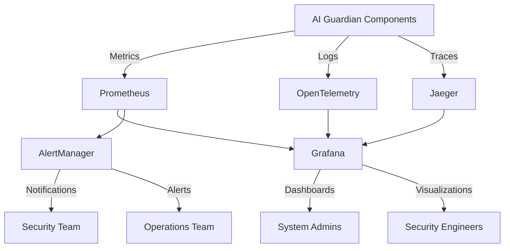
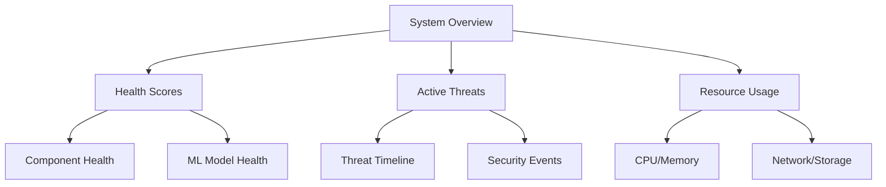

# AI Guardian System Monitoring Architecture

## Overview

The AI Guardian system implements a comprehensive monitoring architecture leveraging industry-standard tools and best practices to ensure optimal system performance, security, and operational efficiency. This document outlines the monitoring strategy, implementation details, and configuration guidelines.

### Architecture Diagram



## Metrics Collection

### Scraping Configuration

Prometheus is configured to scrape metrics from all AI Guardian components with the following specifications:

```yaml
scrape_configs:
  - job_name: 'guardian-core'
    scrape_interval: 15s
    scheme: 'https'
    tls_config:
      cert_file: '/etc/guardian/certs/prometheus.crt'
      key_file: '/etc/guardian/certs/prometheus.key'
    static_configs:
      - targets: ['localhost:9100']
        labels:
          component: 'core'

  - job_name: 'guardian-ml'
    scrape_interval: 30s
    static_configs:
      - targets: ['localhost:9101']
        labels:
          component: 'ml-engine'

  - job_name: 'guardian-security'
    scrape_interval: 10s
    static_configs:
      - targets: ['localhost:9102']
        labels:
          component: 'security'
```

### Security Metrics

Key security metrics collected:

| Metric Name | Type | Description | Labels |
|------------|------|-------------|---------|
| guardian_active_threats | Gauge | Active security threats | severity, type, source |
| guardian_threat_detection_latency | Histogram | Threat detection time | threat_type |
| guardian_ml_model_confidence | Gauge | ML model confidence scores | model_name, version |
| guardian_security_events | Counter | Security event occurrences | event_type, severity |

### Performance Metrics

System performance metrics:

| Metric Name | Type | Description | Labels |
|------------|------|-------------|---------|
| guardian_resource_usage | Gauge | Resource utilization | resource_type, component |
| guardian_response_time | Histogram | System response latency | endpoint, operation |
| guardian_system_health_score | Gauge | Overall health score | component |
| guardian_uptime | Counter | System uptime | instance |

### Custom Metrics

Business-specific metrics:

| Metric Name | Type | Description | Labels |
|------------|------|-------------|---------|
| guardian_manual_interventions | Counter | Manual security interventions | reason, component |
| guardian_automated_responses | Counter | Automated threat responses | response_type, success |
| guardian_false_positives | Counter | False positive detections | detection_type |

## Visualization

### Dashboard Overview

Main system dashboard layout:



### Security Dashboard

Security monitoring visualization:

```yaml
panels:
  - title: "Active Threats"
    type: "stat"
    targets:
      - expr: "sum(guardian_active_threats) by (severity)"
    
  - title: "Threat Detection Performance"
    type: "graph"
    targets:
      - expr: "rate(guardian_threat_detection_latency_sum[5m])"
    
  - title: "ML Model Confidence"
    type: "gauge"
    targets:
      - expr: "guardian_ml_model_confidence"
```

### Alert Rules

Critical alert configurations:

```yaml
groups:
  - name: guardian_alerts
    rules:
      - alert: HighThreatLevel
        expr: guardian_active_threats{severity="critical"} > 0
        for: 1m
        labels:
          severity: critical
        annotations:
          summary: "Critical security threat detected"
          
      - alert: ResourceOverload
        expr: guardian_resource_usage{resource_type="cpu"} > 0.85
        for: 5m
        labels:
          severity: high
        annotations:
          summary: "Resource utilization critical"
```

### Performance Dashboard

System performance monitoring:

```yaml
panels:
  - title: "System Resource Usage"
    type: "graph"
    targets:
      - expr: "guardian_resource_usage"
        legendFormat: "{{resource_type}}"
    
  - title: "Response Time Distribution"
    type: "heatmap"
    targets:
      - expr: "rate(guardian_response_time_bucket[5m])"
    
  - title: "System Health Score"
    type: "gauge"
    targets:
      - expr: "guardian_system_health_score"
```

## Operational Considerations

### Retention Policies

| Data Type | Retention Period | Storage Location |
|-----------|------------------|------------------|
| Raw Metrics | 15 days | Local TSDB |
| Aggregated Metrics | 90 days | Long-term Storage |
| Security Events | 365 days | Secure Archive |
| Performance Data | 30 days | Local TSDB |

### Access Control

| Role | Access Level | Permissions |
|------|-------------|-------------|
| System Admin | Full | Read/Write all metrics |
| Security Engineer | Security Metrics | Read security dashboards |
| Operations | Performance Metrics | Read performance data |
| Auditor | Read-only | View historical data |

### Backup and Recovery

- Metrics data backed up daily to secure storage
- Dashboard configurations version controlled
- Alert rules backed up with system configuration
- Recovery procedures documented and tested monthly

### Security Considerations

- All metric collection endpoints require mTLS
- Dashboard access requires multi-factor authentication
- Metric data encrypted at rest
- Access logs maintained for all monitoring components
- Regular security audits of monitoring infrastructure

## SLA and Performance Targets

| Metric | Target | Alert Threshold |
|--------|--------|----------------|
| System Health Score | ≥ 0.95 | < 0.85 |
| Threat Detection Time | < 100ms | > 500ms |
| Resource Usage | < 5% overhead | > 10% |
| Response Time | < 1s | > 2s |
| Uptime | 99.999% | < 99.9% |

## Troubleshooting Guide

### Common Issues

1. Missing Metrics
   - Verify scrape endpoint accessibility
   - Check TLS certificate validity
   - Validate service discovery configuration

2. Alert Storm Handling
   - Review alert correlation rules
   - Adjust alert thresholds
   - Implement alert grouping

3. Dashboard Performance
   - Optimize query patterns
   - Adjust time ranges
   - Enable caching where appropriate

### Emergency Procedures

1. Monitoring System Failure
   - Switch to backup monitoring instance
   - Preserve metric data
   - Notify security team

2. Critical Alert Response
   - Follow incident response playbook
   - Escalate to appropriate team
   - Document response actions