# AI Guardian System Architecture Documentation
Version: 1.0.0

## 1. System Overview

The AI Guardian system is a high-performance, autonomous security solution for proprietary gaming console platforms, built on a custom FreeBSD-based operating system. The system leverages Temporal.io for workflow orchestration and implements advanced machine learning capabilities for real-time threat detection and response.

### 1.1 Core Components

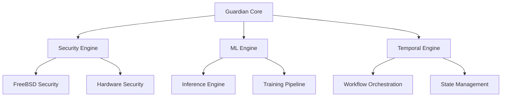

### 1.2 Key Features

- Real-time threat detection using hardware-accelerated ML
- FreeBSD kernel-level security integration
- Temporal.io-based workflow orchestration
- Zero-copy memory operations
- Hardware security module (HSM) integration
- Adaptive performance optimization

## 2. Component Architecture

### 2.1 Guardian Core

The core system implements a modular, event-driven architecture:

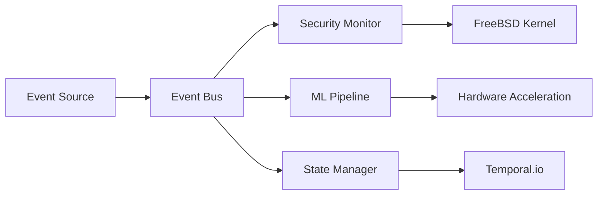

#### Key Components:
- Event processing pipeline
- Security state management
- Resource optimization
- Performance monitoring
- Audit logging

### 2.2 Security Architecture

Multi-layered security implementation:

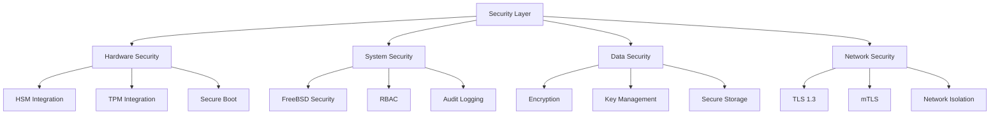

### 2.3 ML Architecture

Hardware-accelerated machine learning pipeline:

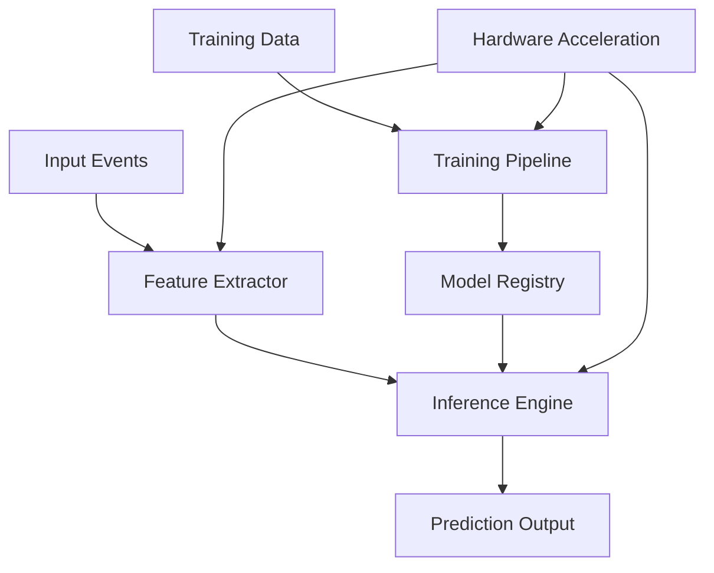

## 3. Data Flow

### 3.1 Event Processing

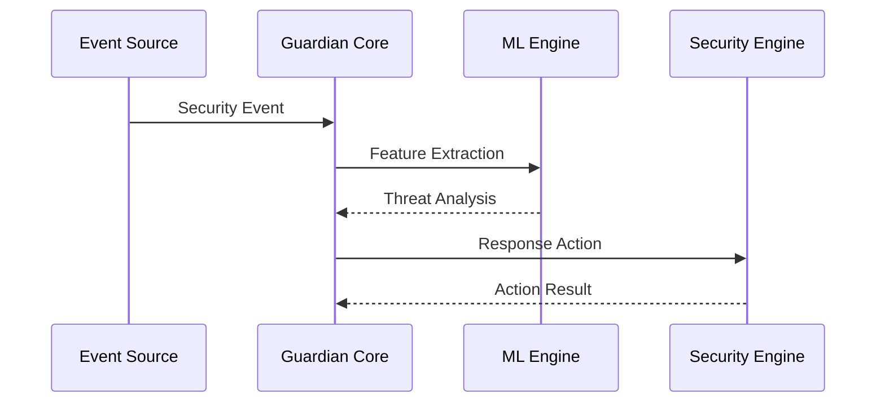

### 3.2 Model Training Flow

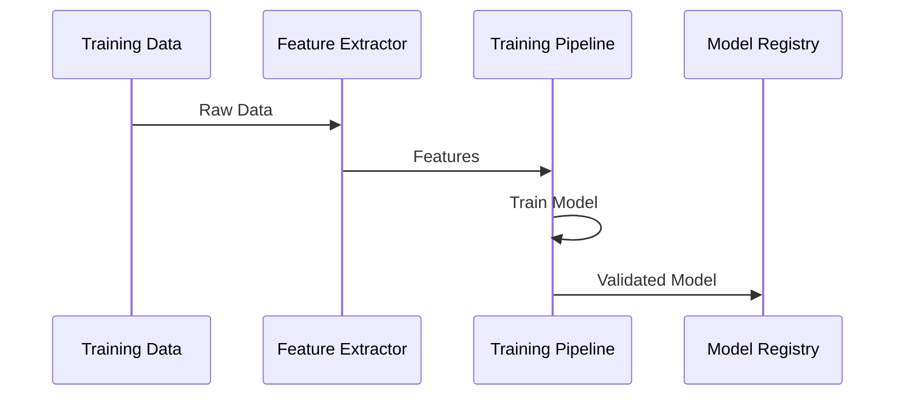

## 4. Performance Optimization

### 4.1 Hardware Acceleration

- GPU acceleration for ML inference
- SIMD optimization for feature extraction
- Zero-copy memory operations
- Hardware-specific optimizations
- Memory-mapped I/O

### 4.2 Resource Management

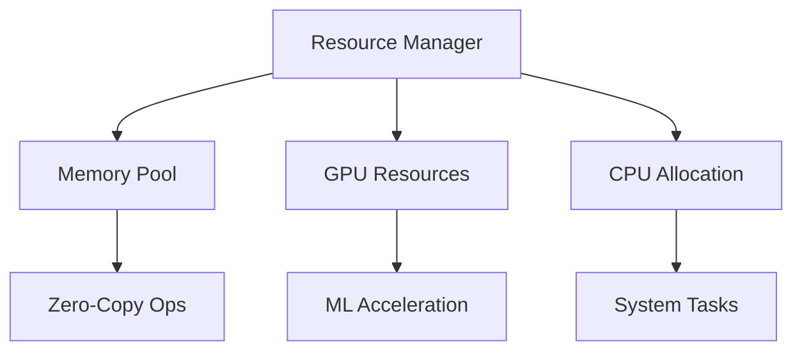

## 5. Deployment Architecture

### 5.1 System Components

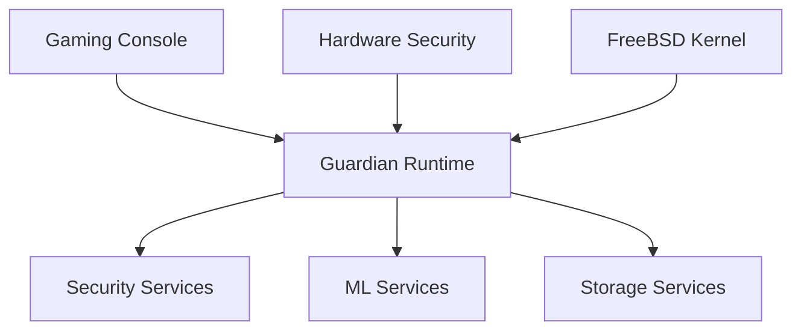

### 5.2 Security Zones

## 6. Integration Points

### 6.1 FreeBSD Integration

- Kernel-level security features
- Memory management optimizations
- Hardware access controls
- System call monitoring
- Resource isolation

### 6.2 Hardware Security

- HSM key management
- TPM attestation
- Secure boot chain
- Hardware encryption
- Anti-tampering measures

## 7. Monitoring and Observability

### 7.1 Metrics Collection

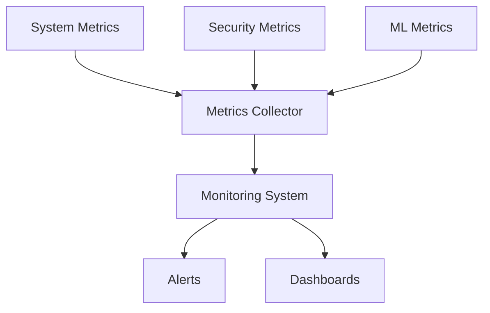

### 7.2 Logging Architecture

- Structured logging
- Audit trail generation
- Performance logging
- Security event logging
- Error tracking

## 8. Disaster Recovery

### 8.1 Backup Strategy

- Secure state backups
- Model version control
- Configuration backups
- Audit log preservation
- System snapshots

### 8.2 Recovery Procedures

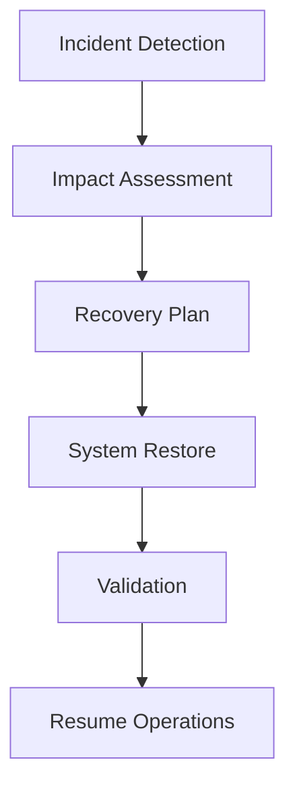

## 9. Security Controls

### 9.1 Access Control

- Role-based access control (RBAC)
- Multi-factor authentication
- Hardware security integration
- Audit logging
- Session management

### 9.2 Data Protection

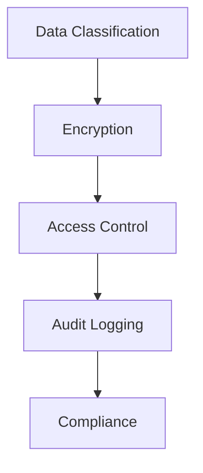

## 10. Compliance and Auditing

### 10.1 Audit Requirements

- Security audits
- Performance audits
- Compliance checks
- Penetration testing
- Code reviews

### 10.2 Documentation Requirements

- Architecture updates
- Security procedures
- Operational guides
- Recovery plans
- Compliance reports

## Appendix A: Version History

| Version | Date | Changes |
|---------|------|---------|
| 1.0.0 | 2024-01 | Initial architecture documentation |

## Appendix B: References

- FreeBSD Security Documentation
- Temporal.io Documentation
- Hardware Security Specifications
- ML Framework Documentation
- System Design Patterns