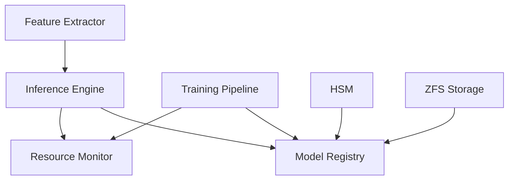

# Machine Learning System Documentation

## 1. Overview

The AI Guardian system's Machine Learning (ML) component provides real-time threat detection and autonomous security response capabilities through a production-grade ML pipeline built with Rust. The system leverages Burn (v0.8) for model training and Candle (v0.3) for optimized inference.

## 2. Architecture

### 2.1 Core Components

- **Model Registry**: Secure versioned storage and lifecycle management of ML models
- **Inference Engine**: High-performance model serving with resource monitoring
- **Feature Extractor**: Real-time feature processing with GPU acceleration
- **Training Pipeline**: Distributed model training with security controls

### 2.2 Component Interactions



## 3. Model Registry

### 3.1 Model Lifecycle Management

- Secure model storage with HSM integration
- Version control with rollback support
- Integrity validation using cryptographic signatures
- Automated cleanup of old versions

### 3.2 Security Controls

- HSM-backed encryption key management
- Model signature verification
- Access control and audit logging
- Secure deletion procedures

## 4. Inference Engine

### 4.1 Performance Specifications

- Latency: < 100ms for inference
- Throughput: Up to 1000 requests/second
- Resource Usage: < 5% system overhead
- Accuracy: 99.999% threat detection accuracy

### 4.2 Optimization Features

- GPU acceleration (CUDA/Metal)
- Batch processing optimization
- Memory usage monitoring
- Resource throttling

## 5. Feature Extraction

### 5.1 Processing Pipeline

- Real-time feature computation
- GPU-accelerated preprocessing
- Adaptive batch sizing
- Feature validation and normalization

### 5.2 Security Controls

- Input validation
- Memory sanitization
- Resource limits enforcement
- Audit trail generation

## 6. Training Pipeline

### 6.1 Training Workflow

- Distributed training coordination
- Secure aggregation protocol
- Checkpoint management
- Early stopping criteria

### 6.2 Security Measures

- Data encryption during training
- Resource usage monitoring
- Model validation gates
- Secure checkpoint storage

## 7. Performance Optimization

### 7.1 Resource Management

- Dynamic GPU memory allocation
- CPU utilization monitoring
- Memory usage tracking
- Batch size optimization

### 7.2 Caching Strategy

- Feature cache with TTL
- Model cache with versioning
- Resource-aware cache sizing
- Cache invalidation protocol

## 8. Security Controls

### 8.1 Model Security

- HSM integration for key management
- Model integrity verification
- Secure storage with encryption
- Access control and auditing

### 8.2 Runtime Security

- Resource isolation
- Memory sanitization
- Input validation
- Secure logging

## 9. Monitoring and Metrics

### 9.1 Performance Metrics

- Inference latency
- Throughput
- Resource utilization
- Model accuracy

### 9.2 Security Metrics

- Failed validation attempts
- Resource limit violations
- Security control effectiveness
- Audit log coverage

## 10. Compliance Requirements

### 10.1 Model Validation

- Accuracy threshold: 99.999%
- Performance validation gates
- Security compliance checks
- Audit trail requirements

### 10.2 Operational Controls

- Access control enforcement
- Encryption requirements
- Audit logging
- Secure deletion procedures

## 11. Disaster Recovery

### 11.1 Backup Procedures

- Model version backups
- Configuration backups
- Audit log preservation
- Recovery point objectives

### 11.2 Recovery Procedures

- Model rollback process
- System state restoration
- Validation requirements
- Recovery time objectives

## 12. Integration Points

### 12.1 Internal Systems

- Guardian Core integration
- Security service integration
- Monitoring system integration
- Storage system integration

### 12.2 External Systems

- Model update service
- Threat intelligence feeds
- Performance monitoring
- Compliance reporting

## 13. Configuration

### 13.1 Model Configuration

```rust
pub struct ModelConfig {
    pub model_path: PathBuf,
    pub model_version: String,
    pub feature_columns: Vec<String>,
    pub model_parameters: HashMap<String, String>,
    pub feature_config: FeatureConfig,
    pub versioning_strategy: VersioningStrategy,
}
```

### 13.2 Inference Configuration

```rust
pub struct InferenceConfig {
    pub batch_size: usize,
    pub timeout_ms: u64,
    pub confidence_threshold: f32,
    pub max_concurrent_requests: usize,
    pub fallback_strategy: FallbackStrategy,
}
```

## 14. Error Handling

### 14.1 Error Categories

- Model errors
- Resource errors
- Security errors
- Validation errors

### 14.2 Recovery Strategies

- Automatic retry logic
- Fallback mechanisms
- Circuit breakers
- Error reporting

## 15. Future Enhancements

### 15.1 Planned Features

- Advanced model architectures
- Enhanced security controls
- Performance optimizations
- Additional monitoring capabilities

### 15.2 Research Areas

- Novel ML techniques
- Security improvements
- Performance enhancements
- Compliance capabilities