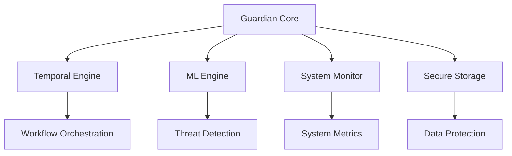

# AI Guardian Backend Documentation

## Overview

AI Guardian is an autonomous security and management solution for proprietary gaming console platforms, built on a custom FreeBSD-based operating system. This document serves as the primary entry point for technical documentation of the backend system.

## System Architecture

### Core Components

- **Guardian Core**: Central security coordination service written in Rust
- **Temporal Engine**: Workflow orchestration using Temporal.io (v1.20+)
- **ML Engine**: Threat detection using Burn (v0.8+) and Candle (v0.3+)
- **System Monitor**: Real-time system metrics and event collection
- **Secure Storage**: ZFS-based encrypted storage system

### High-Level Architecture



## Security Architecture

### Authentication & Authorization

- mTLS with X.509 certificates (4096-bit RSA)
- Hardware Security Module (HSM) integration
- Role-Based Access Control (RBAC)
- Multi-factor authentication support

### Data Protection

- AES-256-GCM encryption for data at rest
- TLS 1.3 for data in transit
- ZFS encryption with GELI
- Secure memory management with Rust

### Audit Logging

- Cryptographically signed audit events
- Secure central logging
- 365-day retention policy
- Real-time monitoring

## Performance Specifications

### System Requirements

- CPU Usage: < 5% system overhead
- Memory Usage: < 5% system memory
- Response Time: < 100ms for critical events
- Uptime: 99.999% availability

### ML Performance

- Inference Latency: < 20ms (P95)
- Batch Processing: Up to 1000 req/sec
- Model Accuracy: 99.999% threat detection
- Resource Usage: < 5% GPU memory

## Setup Instructions

### Prerequisites

- FreeBSD 13.0+
- Rust 1.75+
- CUDA/Metal support (optional)
- HSM device configured

### Environment Setup

1. Install system dependencies:
```bash
pkg install rust llvm openssl
```

2. Configure security settings:
```bash
# Enable Capsicum
sysctl security.capsicum.enabled=1

# Configure ZFS encryption
zfs create -o encryption=on -o keylocation=prompt -o keyformat=passphrase guardian/secure
```

3. Initialize the system:
```bash
cargo build --release
./target/release/guardian init
```

## API Documentation

See [API.md](./API.md) for detailed API specifications.

## Security Documentation

See [SECURITY.md](./SECURITY.md) for comprehensive security documentation.

## ML System Documentation

See [ML.md](./ML.md) for ML system architecture and operations.

## Development Guidelines

### Code Standards

- Follow Rust 2021 edition guidelines
- Comprehensive error handling required
- Security-first development approach
- Full test coverage mandatory

### Security Requirements

- All code must pass security audit
- Memory-safe implementations only
- Proper secret management
- Regular dependency updates

### Performance Requirements

- Optimize for low latency
- Efficient resource usage
- Proper error handling
- Comprehensive metrics

## Operational Procedures

### Deployment

- Secure build pipeline
- Signed artifacts
- Atomic updates
- Rollback support

### Monitoring

- Real-time metrics
- Security event tracking
- Resource utilization
- Performance impact

### Incident Response

- Automated threat detection
- ML-based analysis
- Autonomous response
- Security team escalation

## Version Information

- Guardian Core: 1.0.0
- Rust Version: 1.75+
- Temporal.io: 1.20+
- Burn ML: 0.8+
- Candle: 0.3+

## Support

For technical support and security issues:
- Security Team: security@guardian.example.com
- Technical Support: support@guardian.example.com

## License

Proprietary - All rights reserved

---

**Note**: This documentation is confidential and intended for authorized personnel only.