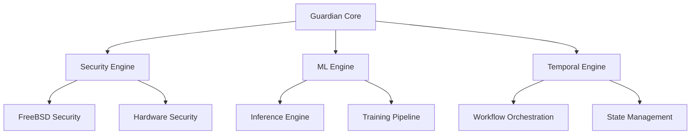
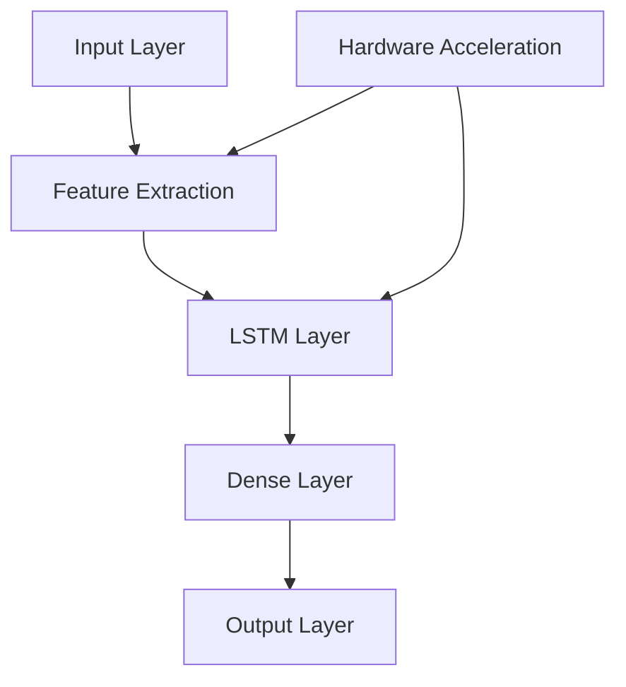

# AI Guardian Backend Documentation

## Overview

AI Guardian is a high-performance, autonomous security and management solution for proprietary gaming console platforms. Built on a custom FreeBSD-based operating system and leveraging Temporal.io for workflow orchestration, the system provides continuous protection through advanced machine learning capabilities and real-time threat detection.

Version: 1.0.0
FIPS Compliance: 140-3
Security Contact: security@aiguardian.system

## Table of Contents

1. [Installation](#installation)
2. [Architecture](#architecture)
3. [Security](#security)
4. [Performance](#performance)
5. [Configuration](#configuration)
6. [API Reference](#api-reference)
7. [ML System](#ml-system)
8. [Monitoring](#monitoring)
9. [Troubleshooting](#troubleshooting)

## Installation

### Prerequisites

- FreeBSD 13.0 or higher
- Rust 1.75+
- CUDA-capable GPU (optional, for ML acceleration)
- Hardware Security Module (HSM)
- Trusted Platform Module (TPM)

### System Requirements

- CPU: 8 cores minimum
- RAM: 16GB minimum
- Storage: 100GB minimum with ZFS support
- Network: 1Gbps minimum

### Setup Steps

1. Install FreeBSD dependencies:
```bash
pkg install rust llvm openssl zfs temporal
```

2. Configure HSM:
```bash
guardian-ctl hsm init --module /usr/lib/softhsm/libsofthsm2.so
guardian-ctl hsm setup-keys
```

3. Initialize secure storage:
```bash
guardian-ctl storage init --pool guardian_pool --encryption aes-256-gcm
```

4. Start core services:
```bash
service guardian start
service temporal start
```

## Architecture

### Core Components



### Key Features

- Real-time threat detection using hardware-accelerated ML
- FreeBSD kernel-level security integration
- Temporal.io-based workflow orchestration
- Zero-copy memory operations
- Hardware security module (HSM) integration
- Adaptive performance optimization

## Security

### Authentication & Authorization

- Multi-factor authentication with hardware token support
- X.509 certificate-based service authentication
- Role-based access control (RBAC)
- Hardware-backed key management

### Encryption

- AES-256-GCM for data at rest
- TLS 1.3 for data in transit
- HSM-backed key operations
- Secure memory handling with automatic zeroing

### Audit Logging

- Comprehensive security event logging
- Tamper-evident log storage
- Real-time log analysis
- FIPS 140-3 compliant operations

## Performance

### Optimization Features

- GPU acceleration for ML inference
- Zero-copy memory operations
- Adaptive batch processing
- Memory pooling and caching
- Hardware-specific optimizations

### Metrics

- Inference time: < 100ms
- Threat detection accuracy: 99.999%
- System overhead: < 5%
- Memory efficiency: Zero-copy operations

## Configuration

### Core Configuration

```yaml
guardian:
  security:
    tls_version: "1.3"
    encryption_algorithm: "AES-256-GCM"
    key_rotation_days: 30
    audit_log_path: "/var/log/guardian/audit.log"

  ml:
    batch_size: 128
    inference_timeout_ms: 100
    memory_limit_mb: 1024
    gpu_enabled: true

  temporal:
    namespace: "guardian"
    workflow_timeout: "24h"
    retry_policy:
      initial_interval: "1s"
      max_interval: "1m"
      max_attempts: 3
```

### Security Configuration

```yaml
security:
  hsm:
    module_path: "/usr/lib/softhsm/libsofthsm2.so"
    slot_id: 0
    key_label: "guardian-master-key"

  tpm:
    device: "/dev/tpm0"
    pcr_mask: 0x0000001F
    
  rbac:
    policy_path: "/etc/guardian/rbac/policy.yaml"
```

## API Reference

### Core Services

```protobuf
service GuardianService {
  rpc GetSystemStatus(Empty) returns (SystemStatus);
  rpc MonitorEvents(EventStreamRequest) returns (stream SystemEvent);
  rpc ExecuteResponse(SecurityResponse) returns (ResponseResult);
}

service SecurityService {
  rpc DetectThreats(Empty) returns (stream ThreatAlert);
  rpc ExecuteResponse(ThreatAlert) returns (SecurityResponse);
}

service MLService {
  rpc InferenceRequest(ModelInferenceRequest) returns (InferenceResult);
  rpc TrainModel(TrainingRequest) returns (TrainingJob);
}
```

### Authentication

All API endpoints require:
- Mutual TLS (mTLS) authentication
- Valid API tokens
- RBAC authorization

## ML System

### Model Architecture



### Training Pipeline

- Automated model training
- Performance validation
- Security verification
- Version control
- Metrics collection

## Monitoring

### Core Metrics

- System health status
- Security threat levels
- ML model performance
- Resource utilization
- API latency

### Alerting

Configure alerts in `/etc/guardian/alerts.yaml`:
```yaml
alerts:
  - name: high_threat_level
    condition: "threat_level > 0.8"
    severity: critical
    channels: ["security_team", "sysadmin"]

  - name: ml_performance_degradation
    condition: "inference_time_ms > 100"
    severity: warning
    channels: ["ml_team"]
```

## Troubleshooting

### Common Issues

| Issue | Solution |
|-------|----------|
| High Latency | Check GPU utilization and batch size |
| Memory Pressure | Verify memory pool configuration |
| Security Alerts | Review audit logs and HSM status |
| ML Errors | Check model validation metrics |

### Logging

Log locations:
- System logs: `/var/log/guardian/system.log`
- Security audit: `/var/log/guardian/audit.log`
- ML metrics: `/var/log/guardian/ml.log`
- Performance data: `/var/log/guardian/metrics.log`

### Support

For security issues:
- Email: security@aiguardian.system
- Emergency: Available 24/7 for critical incidents

For general support:
- Documentation: https://docs.aiguardian.system
- Issue tracker: https://github.com/aiguardian/issues

## License

Copyright © 2024 AI Guardian
All rights reserved.