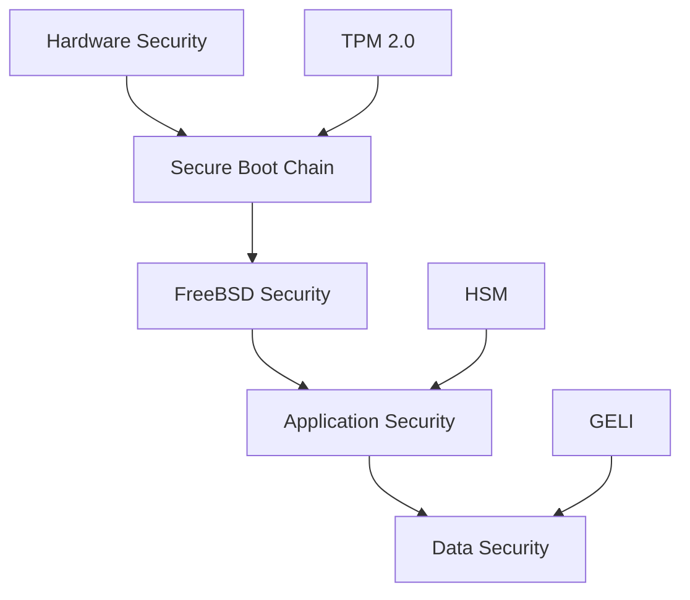
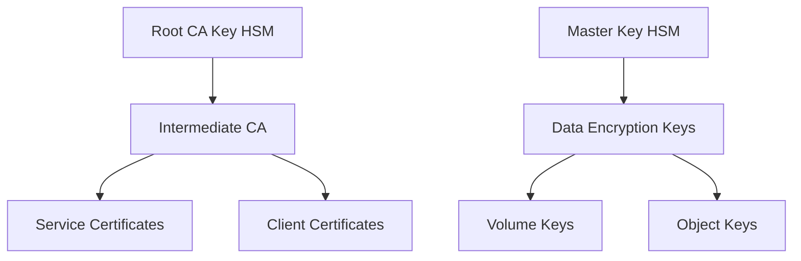
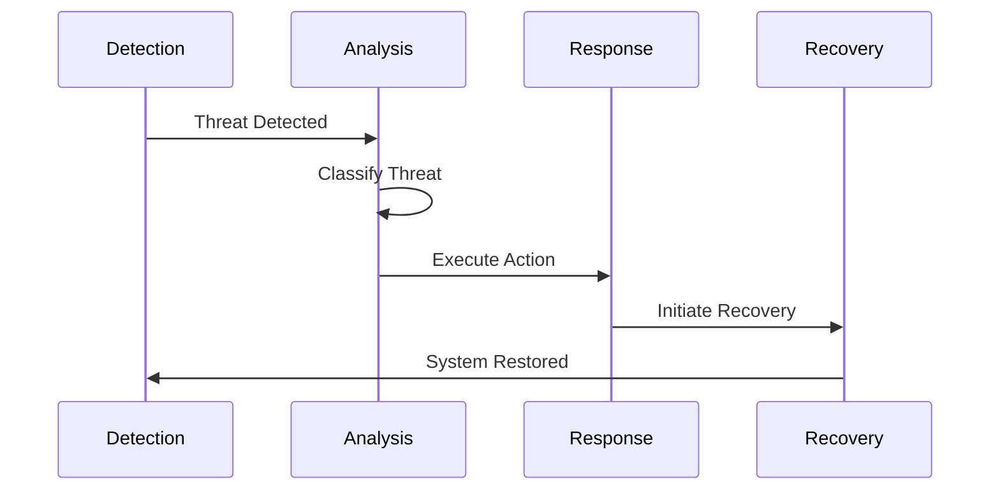
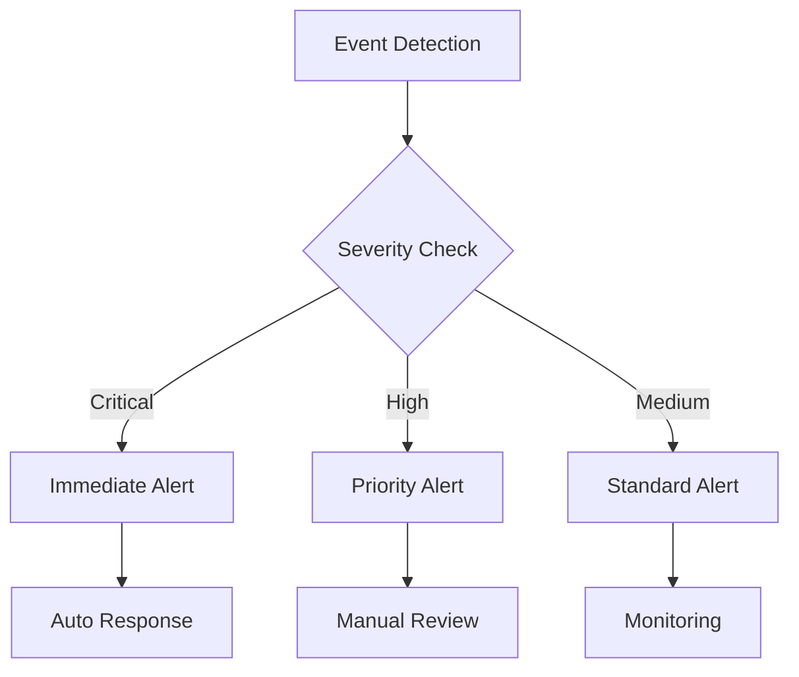

# AI Guardian System Security Documentation
Version: 1.0.0
Last Updated: 2024-01-05

## Table of Contents
1. [Security Architecture Overview](#security-architecture-overview)
2. [Authentication and Authorization](#authentication-and-authorization)
3. [Cryptographic Implementation](#cryptographic-implementation)
4. [Threat Detection and Response](#threat-detection-and-response)
5. [Data Protection](#data-protection)
6. [Security Monitoring](#security-monitoring)
7. [Incident Response](#incident-response)
8. [Compliance and Auditing](#compliance-and-auditing)
9. [Security Best Practices](#security-best-practices)
10. [Infrastructure Security](#infrastructure-security)

## Security Architecture Overview

The AI Guardian system implements a defense-in-depth security architecture leveraging FreeBSD's robust security features, hardware security modules (HSM), and a secure boot chain.

### Core Security Components
- FreeBSD Capsicum capability framework
- TPM 2.0 integration for secure boot
- Hardware Security Module (HSM) for key management
- ZFS encrypted storage with GELI
- Mandatory Access Control (MAC) framework
- Rust memory-safe implementation

### Security Boundaries

## Authentication and Authorization

### Authentication Methods

#### X.509 Certificate Authentication
- Implementation: mTLS with OCSP stapling
- Key size: 4096-bit RSA
- Certificate lifetime: 1 year
- Rotation schedule: 90 days before expiry

#### Multi-Factor Authentication
- Primary: X.509 certificates
- Secondary: TOTP (RFC 6238)
- Tertiary: Hardware security token
- Session management: 15-minute timeout

#### API Key Management
- Format: JWT with EdDSA signatures
- Rotation: Every 30 days
- Revocation: Real-time via Redis blacklist
- Scope: Limited by RBAC policy

### Role-Based Access Control (RBAC)

| Role | Access Level | Permissions |
|------|--------------|-------------|
| System Admin | Root | Full system access |
| Security Engineer | System | Security operations |
| Operator | Limited | Monitoring only |
| Auditor | Read-only | Audit log access |

## Cryptographic Implementation

### Encryption Standards

#### Data at Rest
- Algorithm: AES-256-GCM
- Key management: HSM-backed
- Storage: ZFS with GELI
- Key rotation: 90 days

#### Data in Transit
- Protocol: TLS 1.3
- Cipher suites:
  - TLS_AES_256_GCM_SHA384
  - TLS_CHACHA20_POLY1305_SHA256
- Perfect Forward Secrecy required
- OCSP stapling enabled

#### Key Hierarchy

## Threat Detection and Response

### ML-Based Threat Detection
- Real-time anomaly detection
- Behavioral analysis
- Pattern recognition
- Threat classification

### Response Times

| Threat Level | Response Time | Actions |
|--------------|---------------|----------|
| Critical | < 100ms | System isolation, immediate mitigation |
| High | < 500ms | Automated response, alert escalation |
| Medium | < 1s | Enhanced monitoring, risk assessment |

### Automated Response Workflows

## Data Protection

### Data Classification

| Level | Protection | Storage | Access |
|-------|------------|---------|--------|
| Critical | AES-256-GCM + HSM | Encrypted ZFS | MFA + Audit |
| Sensitive | AES-256-GCM | Encrypted ZFS | RBAC + Audit |
| Internal | AES-256-GCM | Standard ZFS | RBAC |
| Public | None | Standard ZFS | Public |

### Memory Protection
- Rust memory safety guarantees
- ASLR enabled
- Stack canaries
- W^X memory policy
- Secure memory wiping

## Security Monitoring

### Real-Time Monitoring
- System integrity checking
- Network traffic analysis
- Resource usage monitoring
- Behavioral analysis
- Performance impact tracking

### Alert Generation

## Incident Response

### Response Procedures

1. Detection Phase
   - Automated threat detection
   - Alert generation
   - Initial classification

2. Analysis Phase
   - Threat assessment
   - Impact analysis
   - Response planning

3. Containment Phase
   - Threat isolation
   - System protection
   - Evidence preservation

4. Recovery Phase
   - System restoration
   - Service verification
   - Post-incident analysis

### Playbooks
- Critical system compromise
- Data breach response
- Service disruption
- Unauthorized access
- Malware detection

## Compliance and Auditing

### Audit Logging
- Secure central logging
- Tamper-evident logs
- Real-time log analysis
- Retention: 1 year
- Encryption: AES-256-GCM

### Compliance Controls
- Access review (weekly)
- Security patches (daily check)
- Configuration audit (monthly)
- Penetration testing (quarterly)
- Risk assessment (bi-annual)

## Security Best Practices

### Development Guidelines
- Secure coding standards
- Code review requirements
- Security testing
- Dependency management
- Vulnerability scanning

### Operational Security
- Least privilege principle
- Regular security training
- Incident response drills
- Change management
- Asset inventory

## Infrastructure Security

### FreeBSD Hardening
- Minimal installation
- Service hardening
- Kernel security
- Network security
- File system security

### Containerization Security
- Jail isolation
- Resource limits
- Network segregation
- Storage encryption
- Secure communication

### Deployment Security
- Signed artifacts
- Secure boot chain
- Configuration validation
- Health monitoring
- Rollback capability

---

## Document Information
- Version: 1.0.0
- Last Updated: 2024-01-05
- Contributors: Security Team, System Architects, DevOps Engineers
- Classification: Confidential