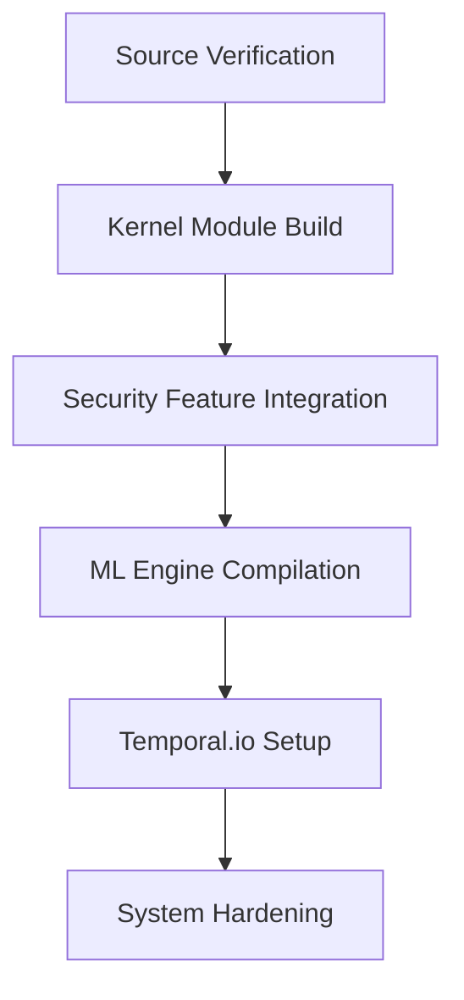
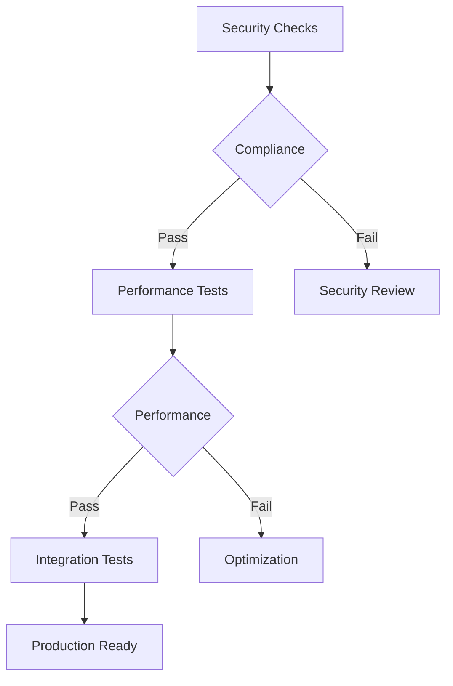

# AI Guardian FreeBSD Installation Guide

## Prerequisites

### Hardware Requirements
- Gaming Console Hardware:
  - CPU: Custom FreeBSD-compatible processor
  - RAM: Minimum 8GB ECC memory
  - Storage: 256GB NVMe SSD with hardware encryption support
  - TPM 2.0 module
  - HSM module for cryptographic operations
  - Network: Dedicated secure network interface

### Software Requirements
- FreeBSD 13.2-RELEASE or later
- Rust 1.75+ toolchain
- Temporal.io SDK 1.20+
- ZFS utilities with encryption support
- Custom kernel modules (see build instructions)

### Development Environment
```bash
# Run development environment setup script
./tools/setup_dev_env.sh
```

## Build Instructions

### 1. Source Code Preparation
```bash
# Clone the repository and verify signatures
git clone https://github.com/ai-guardian/freebsd-security
cd freebsd-security
git verify-commit HEAD
```

### 2. Kernel Module Build
```bash
# Build and verify kernel modules
./tools/build_modules.sh --secure-boot
```

### 3. Component Build Process


## Installation Steps

### 1. System Preparation
```bash
# Prepare the gaming console system
zfs create -o encryption=on -o keylocation=prompt -o keyformat=raw zroot/guardian
```

### 2. Security Component Deployment
```bash
# Deploy core security components
./tools/security_check.sh --pre-install
kldload guardian_core.ko
service guardian_security start
```

### 3. TPM/HSM Integration
```bash
# Initialize TPM and HSM
tpm2_clear
tpm2_startup -c
hsm-init --secure-mode
```

### 4. Network Security Setup
```bash
# Configure secure networking
pf -f /etc/pf.conf
service guardian_network start
```

### 5. Storage Configuration
```bash
# Setup encrypted storage
geli init -b /dev/ada0p4
geli attach /dev/ada0p4
newfs_ufs /dev/ada0p4.eli
```

## Configuration

### Security Policy Setup
```bash
# Configure security policies
guardian-ctl policy import /etc/guardian/security.policy
guardian-ctl mac enable
```

### Performance Optimization
```bash
# Optimize for gaming workloads
sysctl kern.sched.gaming_mode=1
guardian-ctl perf tune
```

### Monitoring Configuration
```bash
# Setup monitoring and alerts
cat > /etc/guardian/monitoring.conf << EOF
interval: 60
alert_threshold: critical
log_level: info
metrics_retention: 90d
EOF
```

## Verification

### Security Compliance
```bash
# Verify security configuration
./tools/security_check.sh --post-install
guardian-ctl audit
```

### Performance Validation
```bash
# Run performance benchmarks
./tools/performance_test.sh --gaming-workload
```

### Integration Testing


## Emergency Procedures

### Recovery Process
1. Boot into recovery mode: `boot -s`
2. Mount encrypted volumes: `geli attach /dev/ada0p4`
3. Start emergency services: `service guardian_emergency start`
4. Run recovery: `guardian-ctl recover --emergency`

### Security Incident Response
```bash
# Initiate security lockdown
guardian-ctl emergency --lockdown
guardian-ctl audit --forensics
```

## Maintenance

### Update Management
```bash
# Configure update system
guardian-ctl update setup --auto-security
guardian-ctl update schedule --maintenance-window "0 2 * * 0"
```

### Health Monitoring
```bash
# Setup health checks
guardian-ctl monitor setup --critical-services
guardian-ctl alert configure --security-team
```

## Support

For technical support and security incidents:
- Emergency: +1-XXX-XXX-XXXX
- Email: security@ai-guardian.com
- Documentation: https://docs.ai-guardian.com/freebsd

---
Version: 1.0.0
Last Updated: 2024-01-05
Security Level: RESTRICTED