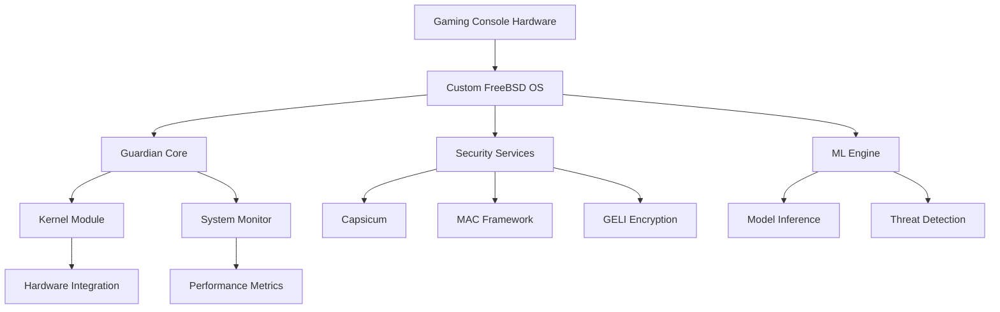
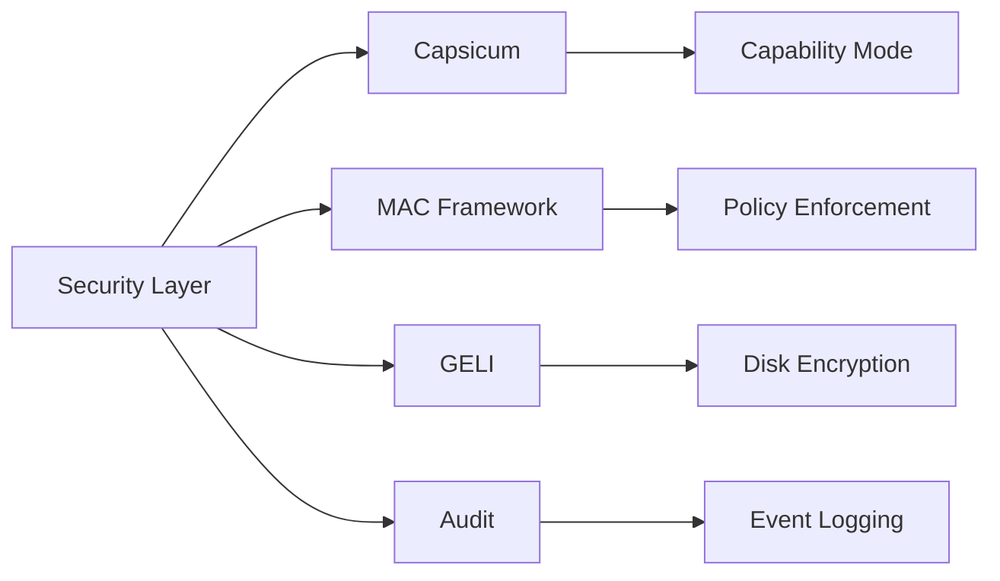
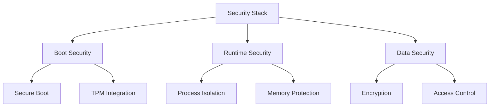
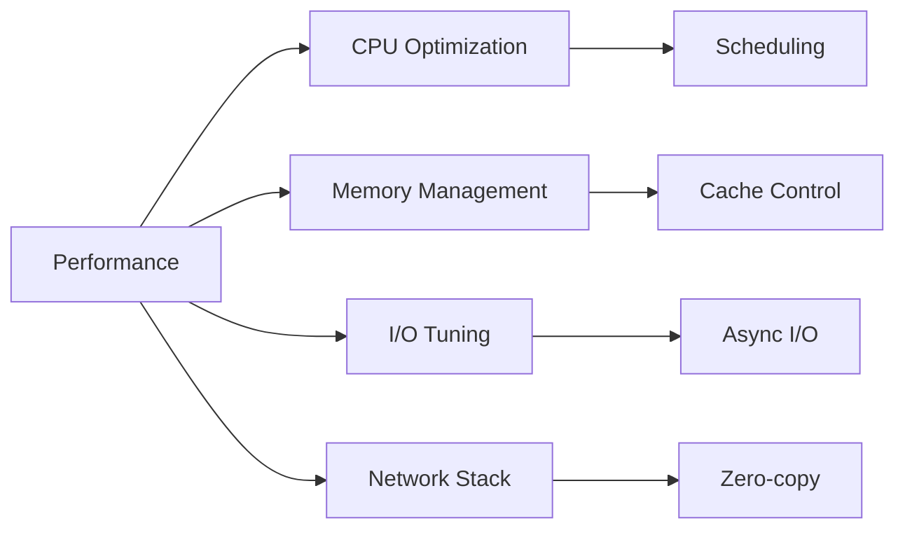

# AI Guardian FreeBSD Components

## Overview

The AI Guardian system is a cutting-edge autonomous security and management solution built on a custom FreeBSD-based operating system for proprietary gaming consoles. This document provides comprehensive documentation of the system architecture, security features, deployment specifications, and development guidelines.

## System Architecture



### Key Features

- Custom FreeBSD-based operating system optimized for gaming consoles
- Comprehensive security features including Capsicum, MAC, and GELI encryption
- Real-time threat detection and response capabilities
- High-performance kernel module for hardware integration
- Advanced monitoring and metrics collection
- Secure boot and runtime protection

### Hardware Requirements

- Proprietary gaming console hardware platform
- Minimum 4-core CPU with hardware virtualization support
- Dedicated GPU for ML inference acceleration
- TPM 2.0 for secure boot and key storage
- Minimum 8GB RAM for optimal performance
- High-speed storage with encryption support

## Getting Started

### Prerequisites

- FreeBSD development environment (13.0-RELEASE or later)
- Rust toolchain (1.75+)
- LLVM/Clang (14.0+)
- Kernel development tools
- Hardware security module (HSM) access
- Development certificates and keys

### Building

```bash
# Set up development environment
./tools/setup_dev_env.sh

# Build kernel modules
./tools/build_modules.sh

# Run security checks
./tools/security_check.sh

# Execute performance tests
./tools/performance_test.sh
```

### Installation

Refer to `INSTALL.md` for detailed installation procedures including:
- Hardware configuration
- Base system installation
- Security hardening steps
- Performance optimization
- Initial system validation

## Core Components

### Kernel Module

The custom kernel module provides:
- Direct hardware access and control
- Memory protection and isolation
- Performance optimization
- Security event monitoring
- Resource management

### Security Features



- Capsicum capability mode for service isolation
- Mandatory Access Control (MAC) framework
- GELI disk encryption
- Comprehensive audit framework
- Secure boot chain
- Runtime protection

## Development

### Build System

- Modular build configuration
- Automated dependency management
- Incremental compilation support
- Cross-compilation capabilities
- Integrated security checks
- Performance profiling

### Testing Requirements

- Unit tests for all components
- Integration testing suite
- Security validation tests
- Performance benchmarks
- Compliance verification
- Hardware compatibility testing

## Security

### Compliance Requirements

- Gaming industry security standards
- Data protection regulations
- System hardening requirements
- Audit logging standards
- Incident response procedures
- Security update policies

### Security Architecture



## Performance Optimization



## Contributing

Please refer to our development guidelines for:
- Code style requirements
- Review process
- Testing procedures
- Documentation standards
- Security considerations
- Performance requirements

## License

Proprietary - All rights reserved

## Contact

For technical support and inquiries:
- Security Team: security@aiguardian.example.com
- Development Team: dev@aiguardian.example.com