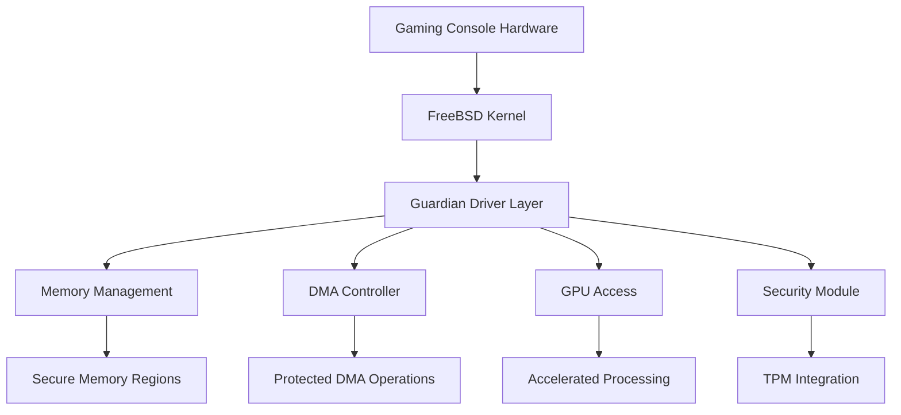
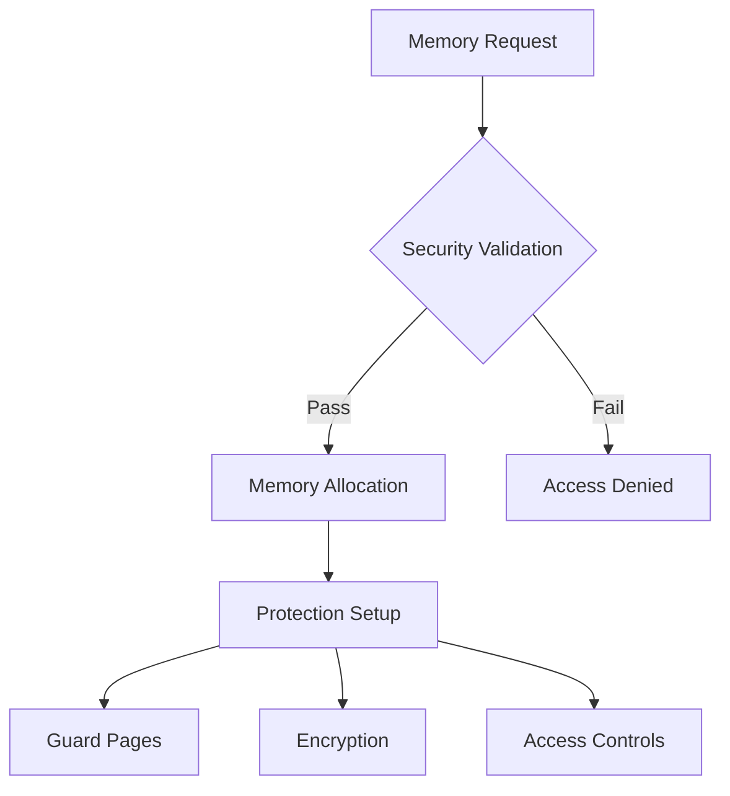
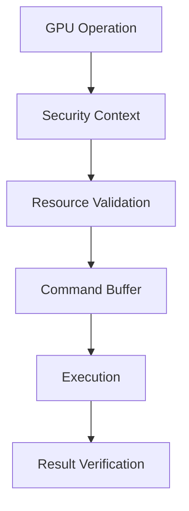
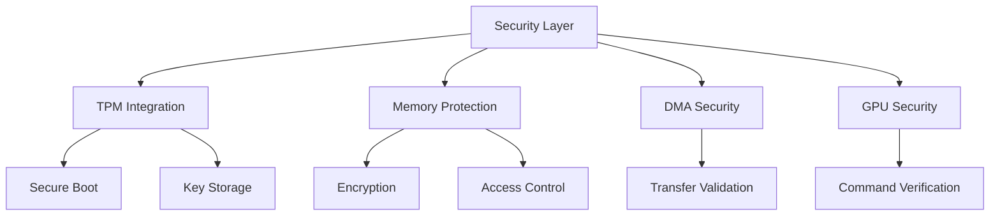
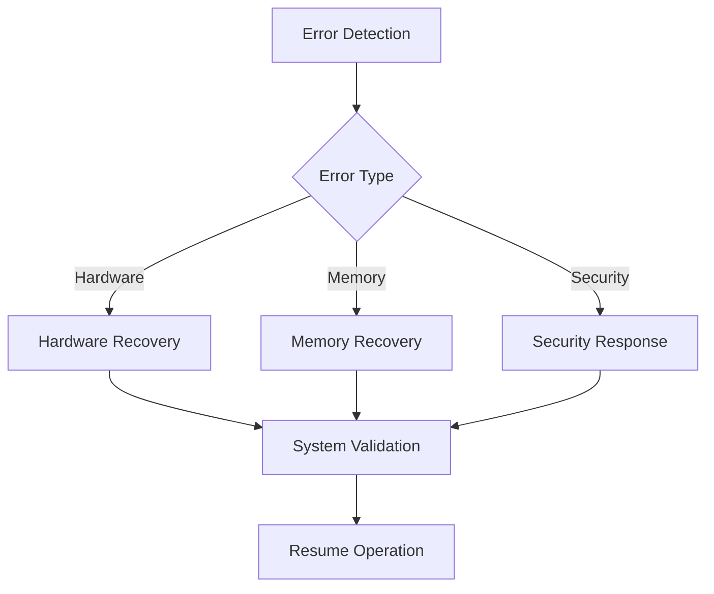

# AI Guardian Hardware Integration Documentation

## Overview

This document details the hardware integration architecture for the AI Guardian system on FreeBSD-based gaming consoles, focusing on security, performance optimization, and error handling procedures.

## Console Hardware Interface

### Architecture Overview



### Driver Implementation

The console hardware interface is implemented through the `guardian_console_ops_t` structure, providing secure access to hardware resources:

```c
// Core initialization with security validation
guardian_status_t guardian_console_init(
    guardian_device_info_t* device_info,
    guardian_security_config_t* security_config);

// Secure hardware access operations
guardian_status_t guardian_console_read(
    uint32_t region_id,
    void* buffer,
    size_t size,
    guardian_security_context_t* sec_ctx);

guardian_status_t guardian_console_write(
    uint32_t region_id,
    const void* buffer,
    size_t size,
    guardian_security_context_t* sec_ctx);
```

## Memory Management

### Memory Protection Architecture



### Secure Memory Operations

Memory management is handled through the `guardian_memory_region_t` structure with comprehensive protection flags:

```c
typedef struct guardian_memory_region {
    void* base;                 // Base address
    size_t size;               // Region size
    uint32_t flags;            // Protection flags
    uint32_t security_level;   // Security classification
    uint32_t access_mask;      // Access permissions
    uint32_t protection_bits;  // Memory protection
} guardian_memory_region_t;
```

## DMA Operations

### Secure DMA Architecture


### Protected DMA Transfers

DMA operations are protected through hardware-level security controls:

- Memory region validation before transfers
- Hardware-enforced access restrictions
- Integrity verification after completion
- Secure DMA channel allocation

## GPU Integration

### GPU Security Architecture



### Acceleration Features

GPU acceleration is implemented with security controls:

- Secure command buffer validation
- Protected memory regions for GPU operations
- Hardware-level access control
- Performance monitoring and optimization

## Security Considerations

### Hardware Security Mechanisms



### Security Validation Flow

1. Hardware initialization with TPM verification
2. Memory region security setup
3. DMA operation validation
4. GPU command authentication
5. Continuous integrity monitoring

## Performance Optimization

### Resource Management


### Optimization Techniques

- Zero-copy operations where possible
- DMA operation batching
- GPU command optimization
- Memory access pattern optimization
- Cache utilization optimization

## Error Handling

### Error Recovery Flow



### Recovery Procedures

1. Hardware error detection and classification
2. Automatic recovery attempt
3. Resource reinitialization if needed
4. Security context validation
5. Operation retry with fallback options

## Compliance Requirements

### Hardware Security Standards

- TPM 2.0 compliance for secure boot
- Memory encryption standards
- DMA protection requirements
- GPU security specifications

### Certification Requirements

1. Hardware security certification
2. Performance validation
3. Error recovery verification
4. Security mechanism testing

## Monitoring and Maintenance

### Performance Monitoring

- Hardware resource utilization
- Memory access patterns
- DMA transfer efficiency
- GPU operation performance
- Error rate tracking

### Maintenance Procedures

1. Regular security validation
2. Performance optimization
3. Error log analysis
4. Hardware health checks
5. Security update deployment