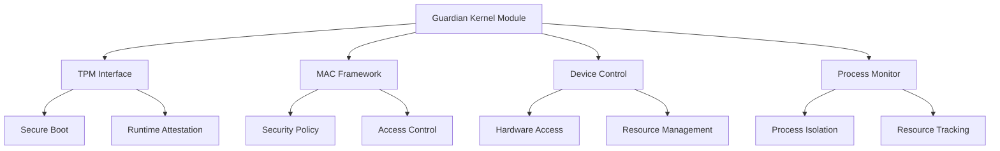

# Guardian System FreeBSD Kernel Module Documentation

## Table of Contents
1. [Overview](#overview)
2. [Architecture](#architecture)
3. [Security Features](#security-features)
4. [Hardware Integration](#hardware-integration)
5. [Implementation Details](#implementation-details)
6. [Troubleshooting Guide](#troubleshooting-guide)

## Overview

The Guardian kernel module provides a secure, high-performance interface between the FreeBSD-based gaming console operating system and hardware resources. Built with a security-first approach, it implements comprehensive protection mechanisms including TPM-based secure boot, MAC framework integration, and capability mode restrictions.

Version: 1.0.0
FreeBSD Version: 13.0

### Key Features
- TPM-based secure boot and runtime attestation
- MAC framework policy enforcement
- Capability mode access controls
- Hardware resource protection
- Process monitoring and isolation
- Audit logging and security event tracking

## Architecture

### Core Components



### Module Initialization Flow

1. TPM validation and secure boot attestation
2. Security context initialization
3. MAC policy framework setup
4. Device and process tracking initialization
5. System call interface registration
6. IOCTL handler setup

## Security Features

### TPM Integration
- Secure boot chain validation
- Runtime state attestation
- Hardware-backed key storage
- Integrity measurement

### MAC Framework
- Custom security policy implementation
- Mandatory access controls
- Resource isolation
- Security label enforcement

### Capability Mode
- Fine-grained access control
- Resource restriction
- Privilege separation
- Secure system call handling

## Hardware Integration

### Device Management
```c
typedef struct guardian_device_info {
    uint32_t id;                      /* Unique device identifier */
    char name[GUARDIAN_MAX_NAME];     /* Device name */
    uint32_t type;                    /* Device type identifier */
    guardian_status_t status;         /* Current device status */
    uint64_t capabilities;            /* Device capability bitmap */
    uint32_t security_level;          /* Device security classification */
} guardian_device_info_t;
```

### Memory Protection
- Secure memory regions
- DMA protection
- Resource access control
- Memory isolation

### Hardware Monitoring
- Performance tracking
- Resource utilization
- Security event detection
- Hardware integrity checks

## Implementation Details

### System Call Interface
```c
enum guardian_syscall_numbers {
    SYS_GUARDIAN_DEVICE_CONTROL = GUARDIAN_SYSCALL_BASE,
    SYS_GUARDIAN_PROCESS_MONITOR,
    SYS_GUARDIAN_SECURITY_CONTEXT,
    SYS_GUARDIAN_TPM_VALIDATE,
    SYS_GUARDIAN_MAC_CONTROL
};
```

### IOCTL Commands
```c
enum guardian_ioctl_cmd {
    GUARDIAN_IOC_GET_DEVICE_INFO,
    GUARDIAN_IOC_SET_DEVICE_STATE,
    GUARDIAN_IOC_GET_PROCESS_INFO,
    GUARDIAN_IOC_SET_PROCESS_STATE,
    GUARDIAN_IOC_GET_MEMORY_STATS,
    GUARDIAN_IOC_SET_SECURITY_POLICY,
    GUARDIAN_IOC_VALIDATE_SECURITY_CONTEXT,
    GUARDIAN_IOC_VERIFY_INTEGRITY
};
```

### Error Handling
```c
typedef enum guardian_error_codes {
    GUARDIAN_SUCCESS           = 0,    /* Operation completed successfully */
    GUARDIAN_ERROR_MEMORY     = 1000,  /* Memory allocation/access error */
    GUARDIAN_ERROR_IO         = 1001,  /* I/O operation error */
    GUARDIAN_ERROR_SECURITY   = 1002,  /* Security violation */
    GUARDIAN_ERROR_INVALID_PARAM = 1003, /* Invalid parameter */
    GUARDIAN_ERROR_AUDIT_FAIL = 1004,  /* Audit logging failure */
    /* ... additional error codes ... */
} guardian_error_code_t;
```

## Troubleshooting Guide

### Common Issues

1. TPM Validation Failures
```c
if ((status = guardian_tpm_validate_state()) != GUARDIAN_STATUS_SUCCESS) {
    GUARDIAN_ERROR_PUSH(status, "TPM validation failed");
    return EINVAL;
}
```
Resolution: Verify TPM state and secure boot chain integrity

2. Security Context Errors
```c
if ((status = guardian_security_context_init()) != GUARDIAN_STATUS_SUCCESS) {
    GUARDIAN_ERROR_PUSH(status, "Security context initialization failed");
    return EINVAL;
}
```
Resolution: Check security context parameters and MAC policy configuration

3. Device Access Issues
```c
status = guardian_sys_device_control(
    (guardian_device_info_t *)req->data,
    cmd,
    &req->security_context,
    NULL);
```
Resolution: Verify device permissions and capability mode rights

### Debugging

1. Enable Debug Output
```c
#define GUARDIAN_INIT_DEBUG           0x00000004
```

2. Check Audit Logs
```c
guardian_audit_context_t audit_ctx;
audit_ctx.timestamp = time_second;
audit_ctx.syscall_number = args->command;
```

3. Verify Security State
```c
guardian_status_t guardian_sys_security_context_validate(
    guardian_security_context_t* sec_ctx,
    uint32_t validation_flags,
    guardian_audit_context_t* audit_info);
```